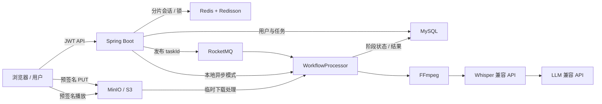

# 视频内容理解平台

一个围绕“大文件上传、异步 AI 处理和高并发削峰”构建的多用户视频内容理解平台。

用户登录后可以通过普通上传、Redis 分片上传或 MinIO 对象存储直传提交视频。后台将上传转换为可追踪的任务，经 FFmpeg、Whisper 兼容接口和 LLM 兼容接口处理，最终返回转写、摘要、播放和历史记录。

当前定位是：功能完整、可本地复现、可量化验证、可用于后端工程师面试讲解。项目保留生产部署能力，但不虚构线上用户量或商业数据。

## 核心链路



业务状态：

```text
上传 -> QUEUED -> TRANSCRIBING -> SUMMARIZING -> COMPLETED
                                      |
                                      +-> FAILED -> 用户重试 / 定时补偿
```

## 已实现能力

| 领域 | 能力 | 可验证证据 |
| --- | --- | --- |
| 用户体系 | 注册、登录、JWT、owner 数据隔离 | 安全集成测试、越权测试 |
| 大文件上传 | 普通上传、并发分片、断点状态、MD5 完整性校验 | 前端上传观测、`ChunkUploadServiceTests` |
| 秒传与去重 | 文件 MD5 命中、内容级 single-flight、结果复用 | 工作流测试、P3/P4 文档 |
| 对象存储 | MinIO/S3、预签名直传、预签名播放、Range 播放 | `verify-deploy.ps1`、媒体测试 |
| 异步工作流 | 本地 `@Async` 与 RocketMQ 两种发布路径、页面异步实验室 | 本地 A/B、k6 压测 |
| 可靠性 | 幂等 claim、分布式锁、失败状态、手动重试、stale task reaper | P3 验证流程 |
| 生命周期 | 终态删除、共享文件保护、持久化清理重试、过期分片回收 | 生命周期测试、页面删除反馈、清理指标 |
| AI 处理 | FFmpeg 抽音频、Whisper 转写、LLM 摘要、Mock 回退 | 单元测试不依赖外部 API |
| 用户体验 | 任务状态、错误原因、历史记录、播放、删除、重试 | 首页工作台 |
| 可观测性 | Actuator、Micrometer、Prometheus、Grafana | MQ A/B 仪表盘 |
| 可选部署 | Docker、MySQL、Redis、RocketMQ、MinIO、Caddy HTTPS | 生产 Compose、preflight/smoke 脚本 |

## 三种运行模式

| 模式 | 配置 | 适用场景 |
| --- | --- | --- |
| 轻量模式 | Redis 关、MQ 关、本地存储 | 开发、单元测试、快速面试演示 |
| 分片模式 | Redis 开、MQ 关 | 分片上传、断点续传、锁与幂等验证 |
| 完整模式 | Redis、MQ、MinIO、MySQL 全开 | 大文件、削峰、对象存储和完整工程演示 |

条件装配让中间件是可选能力，而不是让测试和本地开发被 Docker 或外部 API 绑死。

## 真实 MQ A/B 结果

短压测使用真实 Redis、MySQL、RocketMQ，Mock 转写延迟 2 秒，5 VU，单文件 16 KB：

| 指标 | MQ 关 | MQ 开 |
| --- | ---: | ---: |
| k6 checks | 1365 | 1399 |
| 请求成功率 | 10.25% | 100% |
| HTTP 失败率 | 89.61% | 0% |
| 上传接口 p95 | 22.04 ms | 14.44 ms |

结论：

> RocketMQ 没有改变单个视频的处理成本。它把线程池饱和时用户可见的 HTTP 失败，转换成 broker 中可恢复的排队延迟；增加消费者并发可以提高吞吐，但那来自更多 worker，不是队列本身加速。

历史短复验使用过 RocketMQ 默认 20 个消费线程，因此接收率差异有效，但完成数量不能作为“MQ 自带加速”的证据。当前默认把 MQ consumer 设为 4，与本地线程池 max=4 对齐。

完整方法和原始结果见：

- [MQ A/B 测试方法](docs/LOADTEST.md)
- [实测结果快照](loadtest/results/RESULTS.md)

### 不上服务器也能验证异步

项目内置页面“异步实验室”，会并发上传小型模拟视频并实时显示 HTTP 接收/拒绝、后台任务、排队和完成数。两次结果保存在浏览器，可在重启切换模式后并排比较。

```powershell
# 不需要 Docker：本地 @Async 有界线程池
powershell -NoProfile -ExecutionPolicy Bypass -File scripts\start-async-lab.ps1 -Mode local

# 需要 Docker Desktop：真实 RocketMQ
powershell -NoProfile -ExecutionPolicy Bypass -File scripts\start-async-lab.ps1 -Mode mq
```

同参数本地实测（80 个 16 KB 任务、500 ms Mock、4 worker）：

| 模式 | HTTP 接收 | HTTP 拒绝 | 后台最终完成 | 总耗时 |
| --- | ---: | ---: | ---: | ---: |
| 本地 `@Async` | 54/80 | 26/80 | 80/80 | 18.55 s |
| RocketMQ | 80/80 | 0/80 | 80/80 | 11.32 s |

本地拒绝的任务已先落库，10 秒 stale-task reaper 将它们重新投递，因此最终仍能完成。详细步骤见 [本地异步实验室](docs/ASYNC_LAB.md)。

## 快速启动

环境要求：

- JDK 17+
- Maven 3.8+
- 可选：Docker Desktop、FFmpeg、外部 AI API

### 轻量模式

不依赖 Redis、RocketMQ、Docker、Whisper 或 LLM：

```powershell
$env:APP_REDIS_ENABLED="false"
$env:APP_MQ_ENABLED="false"
$env:APP_TRANSCRIPT_ENABLED="false"
$env:APP_SUMMARY_ENABLED="false"
$env:SPRING_DOCKER_COMPOSE_ENABLED="false"
$env:MANAGEMENT_HEALTH_REDIS_ENABLED="false"
mvn spring-boot:run "-Dspring-boot.run.profiles=h2"
```

访问：

- 工作台：<http://localhost:8081>
- Swagger：<http://localhost:8081/swagger-ui.html>
- Health：<http://localhost:8081/actuator/health>

### 完整中间件验证

启动真实 MySQL、Redis、RocketMQ 后运行端到端验证：

```powershell
powershell -NoProfile -ExecutionPolicy Bypass -File scripts\verify-full-stack.ps1
```

脚本会验证：

1. 注册并获得 JWT；
2. Redis 分片 init/status/chunk/merge；
3. RocketMQ 消费并完成工作流；
4. MySQL 任务持久化；
5. Redis 上传会话清理。

### 可选：生产配置检查

本地完整验证不需要购买服务器。只有计划做公网试用时才执行：

```powershell
Copy-Item .env.example .env
# 修改 .env 中所有 CHANGE_ME 和域名
powershell -NoProfile -ExecutionPolicy Bypass -File scripts\preflight-deploy.ps1
```

部署细节见 [小范围部署说明](docs/P5_SMALL_SCALE_DEPLOYMENT.md)。这部分是保留能力，不是当前主路线。

## 自动化验证

```powershell
# 全量测试
mvn test

# 上传、对象存储、播放
mvn test "-Dtest=MediaControllerTests,DirectUploadServiceTests,S3MediaStorageServiceTests,VideoPlaybackControllerTests"

# 工作流、重试、补偿
mvn test "-Dtest=WorkflowControllerTests,WorkflowProcessorTests,VideoTaskServiceTests,StaleWorkflowTaskReaperTests"

# 前端语法
node --check src/main/resources/static/app.js
```

当前基线：85 个测试，测试环境使用 H2 和 Mock，不依赖 Redis、RocketMQ、Docker、FFmpeg 或外部 AI API。

## 关键设计取舍

### Redis 分片不等于天然加速

Redis 保存上传会话、已上传 chunk、TTL 和锁。真正影响速度的是并发 chunk、chunk size、网络和失败重传。它首先解决可靠性与可恢复性。

### MQ 削峰不等于处理加速

队列只能移动积压位置。消费者能力不变时，接受更多请求会提高端到端等待时间，因此系统同时保留任务状态、监控和 stale task 补偿。

### 对象存储不等于转写加速

浏览器直传减少应用服务器带宽和磁盘压力；工作流仍需要下载媒体并调用 FFmpeg/AI 服务。

### 外部 I/O 不放在长事务中

数据库状态通过短事务逐阶段推进。FFmpeg、Whisper、LLM 等慢 I/O 不长期占用数据库连接。

### 单元测试与中间件解耦

核心边界用 H2、Mock 和接口抽象锁住；真实 Redis/MySQL/RocketMQ 链路由独立 smoke 脚本验证。

## 项目结构

```text
src/main/java/com/example/videoplatform/
├── auth/          JWT 与用户
├── media/         普通/分片/直传、存储、播放
├── workflow/      任务状态机、MQ、锁、重试、补偿
├── transcript/    FFmpeg 与 Whisper
├── summary/       LLM 摘要
├── crawl/         视频信息抓取实验
└── config/        安全、异步、指标、Redis

src/main/resources/static/   前端工作台
loadtest/                    k6 与实测结果
observability/               Prometheus/Grafana
scripts/                     preflight、smoke、handoff
docs/                        P3/P4/P5、演示和排障文档
```

## 演示与面试

- [5-10 分钟演示脚本](docs/DEMO_SCRIPT.md)
- [面试知识点](INTERVIEW_GUIDE.md)
- [功能验证矩阵](docs/VERIFICATION_MATRIX.md)
- [故障排查记录](docs/TROUBLESHOOTING.md)
- [可靠性验证](docs/P3_RELIABILITY_VERIFICATION.md)
- [对象存储验证](docs/P4_OBJECT_STORAGE.md)
- [本地异步实验室](docs/ASYNC_LAB.md)
- [跨模型项目交接](docs/AI_HANDOFF.md)

## 已知边界

- 当前使用 Hibernate `ddl-auto=update`，更大规模上线前应引入 Flyway/Liquibase。
- S3 实现使用 JDK HttpClient + Signature V4，后续可替换官方 SDK。
- 直传完成接口已做 owner/token/idempotency 保护，但还没有独立 upload-session 审计表。
- 当前压测证明 MQ 的削峰语义，不代表生产容量承诺。
- 项目暂未长期运营公网 SaaS，不虚构用户量、收入或 SLA。

## 一句话介绍

> 这是一个多用户视频内容理解平台：用 Redis 分片会话和锁保证大文件上传可靠性，用 MinIO 直传降低应用服务器压力，用 RocketMQ 把流量峰值从 HTTP 失败转换为内部排队，再通过幂等、重试、补偿和指标保障 FFmpeg/Whisper/LLM 异步工作流可追踪、可恢复。
