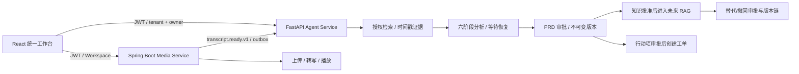
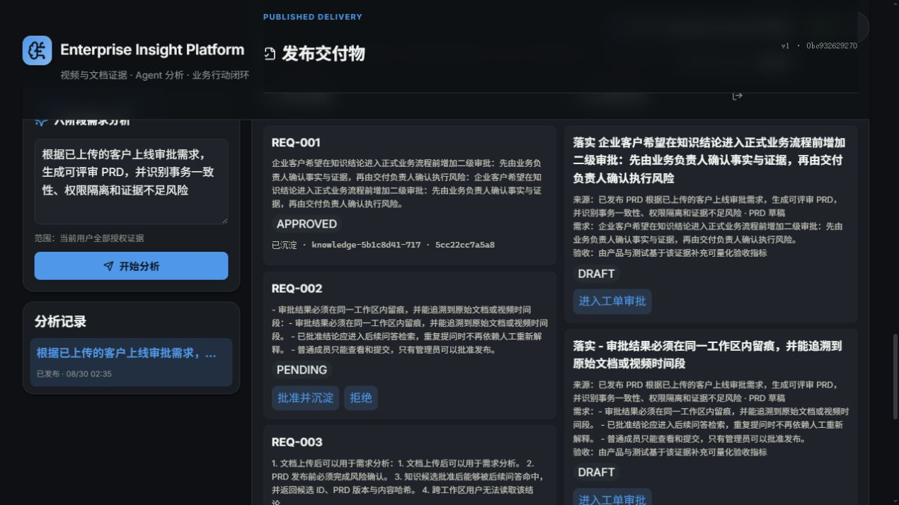
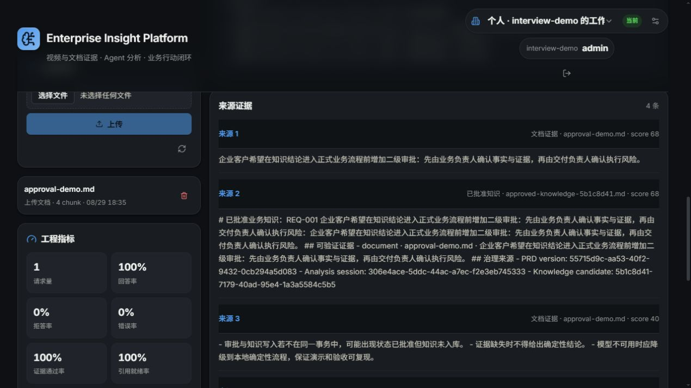
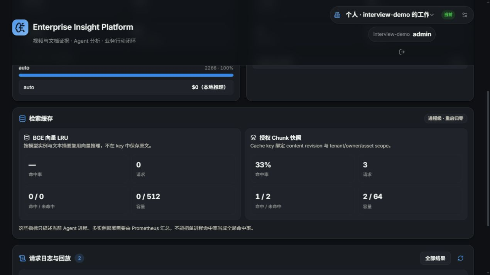

# Enterprise Insight Platform

面向客户访谈、需求评审和故障复盘的企业多模态洞察平台：把视频与业务文档转化为可回放证据、结构化分析、可评审 PRD、受治理知识和可追踪行动项。

它不是“视频站 + 聊天机器人”的页面拼接。项目用统一身份、Workspace、版本化契约和一条纵向业务链路，把媒体处理与 Agent 分析整合为一个产品。

## 90 秒了解项目



当前主链路：

1. 上传会议视频，查看可恢复的异步处理状态。
2. 带时间段的转写通过事务 outbox 幂等进入 Agent Service。
3. 用户跨视频/文档提问，答案引用可点击回放的证据。
4. Agent 经过意图、干系人、领域、风险、收敛、PRD 六阶段分析。
5. objective 驱动授权 hybrid 检索并冻结证据；信息不足时持久化等待，人工补充后保留阶段 1–4，仅重算收敛与 PRD，并以 CAS 一次性消费恢复 token。
6. personal Workspace 使用 OWNER 二次确认发布；team Workspace 必须不同成员四眼审批。
7. 发布生成不可变 PRD、知识候选和行动项；知识与工单分别经过独立审批。
8. 批准知识以版本、哈希和原始证据物化，并被后续 RAG 检索命中。
9. 过期或错误知识通过独立审批被替代/撤回；旧版本保留审计，未来 RAG 与图谱只读取活跃版本。

## 工程证据

| 能力 | 当前可验证证据 |
| --- | --- |
| Agent Service | 130 个自动化用例，覆盖目标证据快照、并行 specialist、阶段恢复、并发 CAS、检索、审批、隔离、工具与知识版本治理 |
| Media Service | JDK 17/18 下 108 个自动化用例 |
| Agent 质量 | V6 RAG 42 例 + PRD V1 12 例 + Knowledge Lifecycle V1 3 类场景三套独立门禁 |
| 平台纵向链路 | 33 项 localhost-only 自动验收，不需要域名、服务器或外部模型 |
| Web | TypeScript project build + Vite production build |
| 维护知识 | Skill + 语义 Top-K 索引 + 增量向量复用 + revision 查询缓存 + CI 漂移检查 |

详细、可审计的测试口径见 [`knowledge/QUALITY.md`](knowledge/QUALITY.md)。

## 面试演示实录

以下截图来自本机三服务真实联调，不是设计稿：

| 知识批准后物化 | 后续 RAG 召回治理来源 | 授权缓存命中可观测 |
| --- | --- | --- |
|  |  |  |

完整现场顺序、提问文本和失败兜底见 [`docs/DEMO_SCRIPT.md`](docs/DEMO_SCRIPT.md)；可直接开口练习的一分钟介绍、逐分钟话术和三段项目故事见 [`docs/INTERVIEW_REHEARSAL.md`](docs/INTERVIEW_REHEARSAL.md)。

## 一键无服务器验收

需要 Python 3.12、Maven 与 JDK 17/18：

```powershell
pip install -r services/agent-service/requirements.txt
python scripts/local_acceptance.py
```

脚本自动启动两个后端到随机 `127.0.0.1` 端口，使用临时 H2、SQLite、本地文件与 mock/local AI，验证真实 JWT、个人/团队隔离、视频证据、等待恢复、PRD 审批、知识沉淀与替代/撤回、历史引用状态、工单审批、缓存安全边界和 Range 播放。

需要保留数据的本地工作台：

```powershell
./scripts/start_local.ps1 -Build
# 打开 http://127.0.0.1:8080
```

完整发布与备份恢复步骤见 [`docs/LOCAL_RELEASE_RUNBOOK.md`](docs/LOCAL_RELEASE_RUNBOOK.md)。

## 面试入口

- [`docs/PROJECT_CLOSEOUT.md`](docs/PROJECT_CLOSEOUT.md)：正式收尾结论、封板证据、面试前检查和重新打开规则。
- [`docs/INTERVIEW_GUIDE.md`](docs/INTERVIEW_GUIDE.md)：一分钟介绍、架构取舍、高频追问、证据与不能夸大的边界。
- [`docs/DEMO_SCRIPT.md`](docs/DEMO_SCRIPT.md)：8 分钟主链路演示与无 UI 兜底方案。
- [`docs/INTERVIEW_REHEARSAL.md`](docs/INTERVIEW_REHEARSAL.md)：可计时练习的口述稿、逐分钟演示、三段完整故事和追问速答。
- [`docs/INTERVIEWER_STRESS_REVIEW.md`](docs/INTERVIEWER_STRESS_REVIEW.md)：站在面试官角度审查代码真实性、简历技术映射、连续追问和危险回答。
- [`knowledge/TECHNICAL_IMPLEMENTATION.md`](knowledge/TECHNICAL_IMPLEMENTATION.md)：完整代码框架、数据流、RAG、缓存和 Agent 工程说明。
- [`knowledge/decisions/`](knowledge/decisions/)：重要决策的背景、选型与后果。

## 仓库结构

| 路径 | 职责 |
| --- | --- |
| `services/media-service` | Spring Boot 媒体上传、存储、转写、播放、Workspace/JWT 与可靠异步工作流 |
| `services/agent-service` | FastAPI 证据摄取、授权 RAG、六阶段分析、发布治理、知识与受控工具 |
| `apps/web` | React 统一登录、Workspace、媒体、问答、分析、图谱、工单与监控工作台 |
| `contracts` | JWT、事件和 HTTP 机器可验证契约 |
| `knowledge` | 产品、架构、安全、质量、ADR 与生成式结构快照 |
| `skills/enterprise-insight-maintainer` | 项目维护 Skill 与语义知识查询入口 |

## 真实边界

当前交付是可本地复现的工程型试点，不宣称已经获得生产用户量或 99.9% SLA。localhost 验收中的 mock AI 证明状态机、鉴权、证据、审批和恢复链路，不等同于真实模型质量或生产吞吐。正式上线仍需确定 IdP/即时撤权、数据保留与模型数据策略，并重新验证统一平台的 MySQL、Redis、RocketMQ、S3、真实转写/LLM、迁移、告警和灾备。
