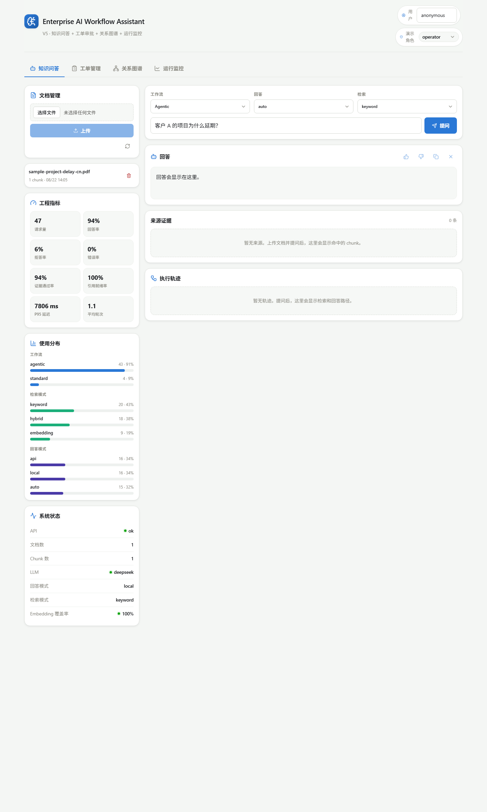
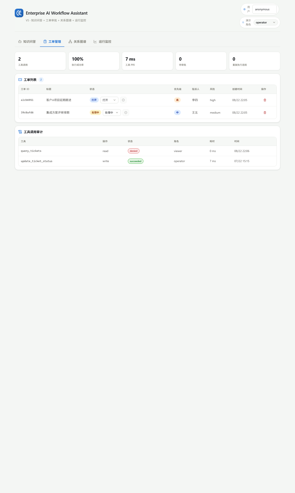
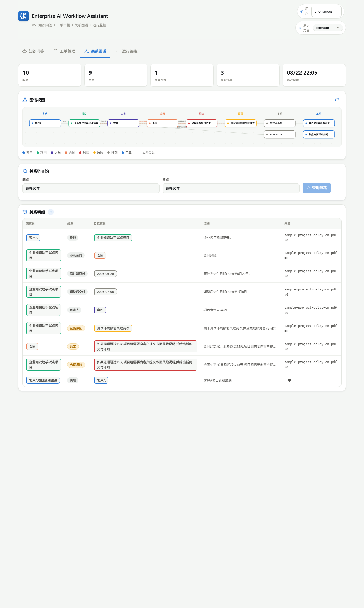
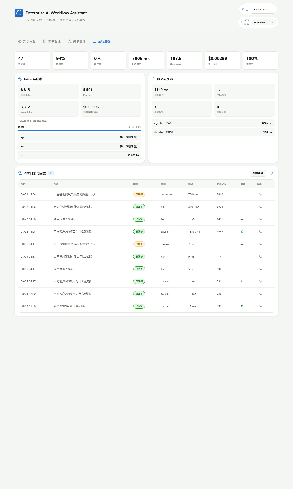

# Enterprise AI Workflow Assistant

[](https://github.com/Victorica123/enterprise-ai-workflow-assistant/actions/workflows/ci.yml)
[](LICENSE)

企业智能工单与知识助手平台：一个从 V1 迭代到 V6 的 **Agentic RAG 全链路参考实现**——知识库问答、多轮检索、关系图谱、工具调用、人工审批、评测门禁与 token 成本观测，全部内置于一个零外部依赖（无 Neo4j / 无向量数据库 / 无需 API Key）的单体仓库。

```text
上传文档 → 解析切块 → SQLite/embedding + 图谱抽取 → 问题分类 → query 计划
→ 一到两轮检索 → 证据门控 → Graph Agent 关系链 → Tool Agent → 回答 → 引用审核
→ trace / token 成本 / 请求日志 / 用户反馈
```

## 快速开始

环境要求：**Python 3.10+**、**Node 18+**。以下命令在仓库根目录执行（Windows / macOS / Linux 通用）。

```bash
# 1. 启动后端（无需任何 API Key，本地模板模式即可完整体验）
cd apps/api
pip install -r requirements.txt
# 国内网络下载慢可改用镜像：pip install -r requirements.txt -i https://pypi.tuna.tsinghua.edu.cn/simple
uvicorn app.main:app --reload --port 8000

# 2. 启动前端（新开一个终端，回到仓库根目录）
cd apps/web
npm install
npm run dev
```

打开 <http://127.0.0.1:5173> 即可使用。API 交互文档见 <http://127.0.0.1:8000/docs>。

可选：灌入演示数据（示例 PDF 语料 + 工单 + 监控面板流量），让每个面板都有内容：

```bash
# 回到仓库根目录
python scripts/seed_demo.py
```

**零配置也能跑**：默认回答模式为 `local`（内置模板 + 检索证据，不调用外部 LLM），
检索默认走关键词模式，embedding 模型缺失时自动降级为哈希向量。接入 DeepSeek/OpenAI、
真实语义 embedding 等增强能力见下方[可选配置](#可选配置)。

### Docker 一键启动（可选）

```bash
docker compose up --build
```

访问 <http://127.0.0.1:8080>（前端 nginx 托管，`/api/` 同源反代后端，SQLite 数据落在
`api-data` 卷）。CI 会构建两个镜像并做 compose 冒烟测试，保证 Dockerfile 始终可用。

## 界面预览

| 知识问答（证据 + 执行轨迹） | 工单与审批 |
| --- | --- |
|  |  |

| 关系图谱（分层可视化） | 运行监控（指标 / 成本 / 日志回放） |
| --- | --- |
|  |  |

> 截图来自 `python scripts/seed_demo.py` 灌入演示数据后的界面；支持 `#/qa` `#/tickets` `#/graph` `#/monitor` 深链直达。

## 核心特性

| 能力 | 说明 |
| --- | --- |
| 知识库问答（V1） | 上传 `.txt` / `.md` / `.pdf`，切块入库，keyword / embedding / hybrid 三种检索 |
| Agentic RAG（V2） | 问题分类 → query 改写计划 → 最多两轮检索 → 动态重查，全程 trace 可回放 |
| 防幻觉三层门控 | 证据分数 + 意图覆盖 + 主题锚点；含数字/日期/百分比的陈述必须找到来源锚点 |
| 工单与工具调用（V3） | 4 个受控工具（function-calling 风格），写操作只生成草稿，人工批准后原子执行 |
| 人工审批 | 审批队列、15 分钟 TTL、幂等去重、并发抢占（`begin immediate`）、重复执行违规指标 |
| 关系图谱（V4） | 规则式实体/关系抽取 + SQLite 图存储 + BFS 关系链（学习版 GraphRAG，无需 Neo4j） |
| 观测与成本（V5） | 真实 token 用量与美元成本核算、请求日志回放、用户反馈闭环、P95 延迟等指标 |
| 评测门禁（V6） | 87 个回归测试 + V2–V6 五道离线门禁 + 42 条黄金评测集基线，防止优化后回退 |
| 安全加固 | 角色鉴权全覆盖、审批职责分离（四眼）、LLM 工具白名单、异常不外泄、结构化日志 |

## 安全模型

演示级鉴权通过 `X-User-Role` 请求头（viewer / operator / admin，默认 viewer）：

- **写操作**（上传/删除文档、重建 embedding/图谱、工单增删）要求 operator/admin；
- **审计数据**（`/chat-logs`、`/tool-calls`、`/pending-actions`）含问题原文与工具入参，仅 operator/admin；
- `/metrics/*` 聚合数据对所有角色开放。

审批职责分离：请求与审批可携带 `X-User-Id`，已知身份下发起人不能审批自己的写操作
（前端顶栏「用户」输入框可切换身份演示四眼审批；`APPROVAL_SOD_ENFORCED=0` 可关闭，
匿名请求不比对以保留单人演示体验）。角色策略集中在 `apps/api/app/auth.py`，
替换为 JWT/OIDC 时只需改这一个模块。

Agent 层防护：LLM 选择的工具名先过注册白名单，幻觉工具不进入执行；
槽位抽取在工单 ID / 目标状态不明确时拒绝生成草稿，不静默猜默认值。

## 可选配置

后端配置通过 `apps/api/.env` 管理，模板见 [`apps/api/.env.example`](apps/api/.env.example)
（复制为 `.env` 后按需修改，所有项都有安全默认值）。

| 配置 | 作用 | 默认 |
| --- | --- | --- |
| `DEEPSEEK_API_KEY` / `OPENAI_API_KEY` | 接入真实 LLM 回答（`DEFAULT_ANSWER_MODE=api/auto` 时生效） | 未配置 → 本地模板模式 |
| `EMBEDDING_MODEL` | 真实语义 embedding（fastembed/BGE-small-zh，512 维本地 ONNX） | 装了 fastembed 即启用；置空强制哈希降级 |
| `RERANKER_MODEL` | cross-encoder 精排（增加延迟，默认关闭） | 空 |
| `LLM_ROUTER_ENABLED` | LLM 路由/规划/工具选择（关闭走规则版，离线门禁默认关闭） | 1 |
| `APPROVAL_SOD_ENFORCED` | 审批职责分离开关 | 1 |
| `LLM_PROMPT_PRICE_PER_1M_USD` 等 | token 成本核算单价 | DeepSeek 公开价 |

安装真实 embedding（推荐，检索质量显著提升）：

```bash
pip install -r apps/api/requirements-embedding.txt
```

## API 一览

完整契约见 <http://127.0.0.1:8000/docs>，主要端点：

| 端点 | 说明 | 权限 |
| --- | --- | --- |
| `POST /chat` | 问答（standard / agentic 工作流） | 所有角色 |
| `POST/GET/DELETE /documents` | 文档上传/列表/删除 | 写操作需 operator+ |
| `GET/POST/DELETE /tickets`、`POST /tickets/{id}/status-draft` | 工单管理与状态草稿 | 写操作需 operator+ |
| `GET /pending-actions`、`POST /pending-actions/{id}/approve` | 审批队列与批准/拒绝 | operator+ |
| `GET /graph/*`、`POST /graph/rebuild` | 图谱概览/实体/关系/关系链/重建 | 重建需 operator+ |
| `GET /chat-logs`、`GET /chat-logs/{id}` | 请求日志与 trace 回放 | operator+ |
| `POST /chat-logs/{id}/feedback` | 👍/👎 反馈 | 无限制 |
| `GET /metrics/summary`、`GET /metrics/tools`、`GET /tool-calls` | 指标与工具审计 | metrics 全角色；tool-calls 需 operator+ |

## 测试与评测门禁

```bash
cd apps/api
LLM_ROUTER_ENABLED=0 python -m pytest tests -q      # 87 个回归测试

# 五道离线评测门禁（V2 防幻觉 / V3 审批安全 / V4 图谱 / V5 观测 / V6 黄金集）
python ../scripts/evaluate_v2.py   # 依次运行 evaluate_v2 ~ evaluate_v6
```

CI（`.github/workflows/ci.yml`）在每次 push/PR 自动执行以上全部检查 + 前端 tsc/build。

墙钟类门禁（v2 P95≤200ms、v4 P95≤150ms）含本地 ONNX 推理/SQLite IO，阈值已为共享
runner 的波动预留余量；算法级回退（N+1 检索、重复嵌入）仍会显著超标被拦截。

## 项目结构

```text
apps/
  api/                    FastAPI 后端
    app/
      routes/             HTTP 端点（chat / documents / tickets / graph / observability）
      agentic_rag.py      Agentic 编排：Router → Planner → Retriever → Graph → Tool → Reviewer
      slot_extraction.py  工具槽位抽取（标题/优先级/工单ID/目标状态）
      rag.py              标准 RAG + 证据门控 + 引用审核
      retrievers.py       keyword / embedding / hybrid（RRF 融合）
      graph_store.py      SQLite 图存储 + BFS 关系链
      ticket_store.py     工单 / 审批 / 工具审计（原子抢占、幂等、TTL）
      tools.py            受控工具注册表（白名单校验、审批草稿）
      llm_router.py       LLM 路由/规划/工具选择（规则版降级）
      logging_config.py   JSON 结构化日志
    tests/                87 个回归测试
  web/                    React 19 + Vite 前端（问答/工单/图谱/监控四个面板）
scripts/
  evaluate_v2~6.py        离线评测门禁
  golden/                 V6 黄金评测集（42 条标注 + 语料 + 基线存档）
  seed_demo.py            演示数据种子脚本
docs/                     指南与设计文档（见 docs/README.md）
```

## 文档

- [架构说明](docs/architecture.md)——分层图、Agentic 流水线、审批时序、数据模型（Mermaid）
- [项目总结报告（架构图 · 指标 · 路线）](docs/project-report.md)
- [工程化落地优化路线](docs/engineering-optimization.md)
- [V1 学习与开发说明](docs/v1-guide.md)
- [文档索引](docs/README.md)

参与贡献见 [CONTRIBUTING.md](CONTRIBUTING.md)。

## 后续路线

生产化升级：真实 embedding + PostgreSQL/pgvector、Neo4j + LLM 抽取、LangGraph 编排、
JWT 鉴权与多租户。详见 `docs/engineering-optimization.md`。

## License

[MIT](LICENSE)
