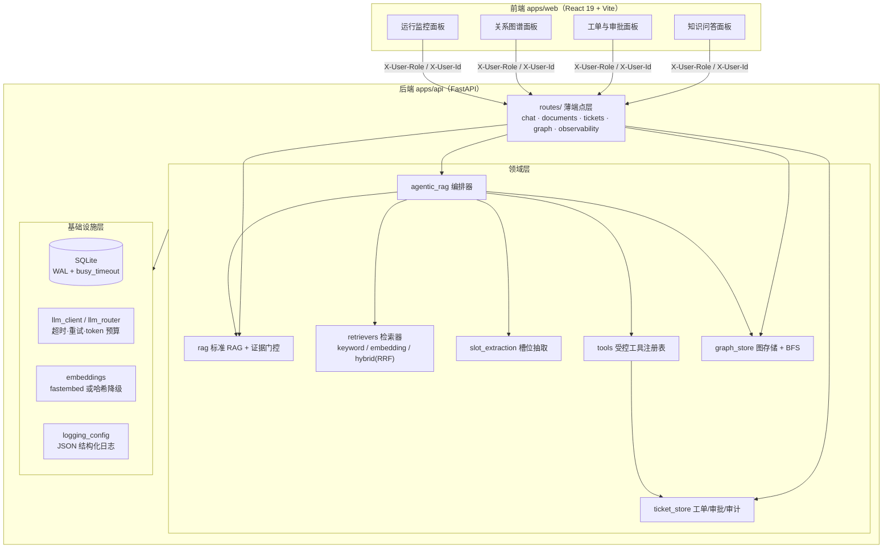
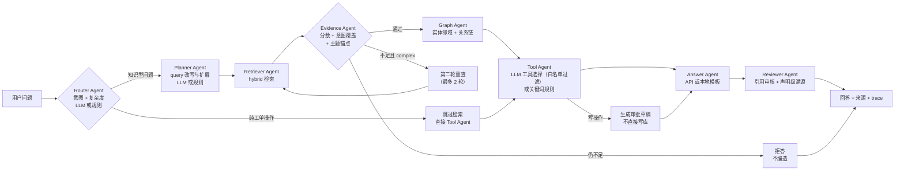
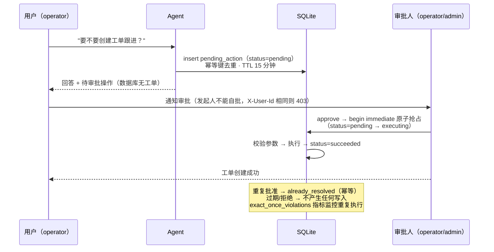
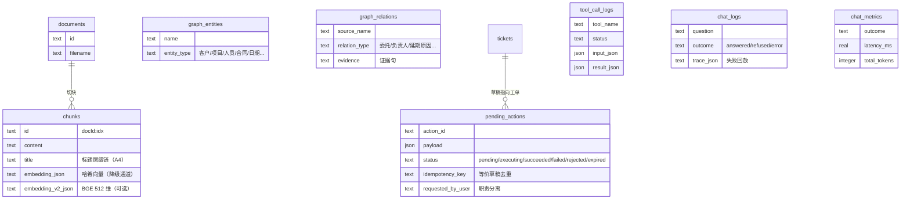

# 架构说明

本文用图讲清楚三件事：系统怎么分层、一次 Agentic 问答怎么流转、一次写操作怎么被审批。
所有图均为 Mermaid，GitHub 原生渲染。

## 系统分层

要点：

- **路由层只做协议转换**，业务在领域层；`main.py` 只负责装配（lifespan 初始化 + CORS + 路由注册）。
- **鉴权策略集中在 `app/auth.py`**：所有端点读 `X-User-Role`，写操作与审计数据要求 operator+，替换为 JWT/OIDC 只改这一个模块。
- **SQLite 单文件承载全部持久化**（文档/chunk/向量、图谱、工单、审批、审计、指标），WAL + `busy_timeout` 应对读写并发，生产化时替换为 PostgreSQL + pgvector（见 [engineering-optimization.md](engineering-optimization.md)）。

## Agentic 问答流水线

防幻觉是分层的：检索分数门控挡低质证据，主题锚点挡词面重合的无关语料，
含数字/日期/百分比的陈述必须在来源中找到锚点，否则附审核提示；证据不足时明确拒答。

## 写操作审批流（Human-in-the-loop）

## 数据模型（核心表）

隐私分层：`chat_metrics` 只有聚合指标不含问题原文；含原文的 `chat_logs` / `tool_call_logs`
对应端点要求 operator+ 角色。

## 关键设计取舍

| 取舍 | 选择 | 理由 |
| --- | --- | --- |
| 图数据库 | SQLite + BFS（≤4 跳） | 学习版 GraphRAG 零部署门槛；生产换 Neo4j 时 `graph_store` 是唯一改动点 |
| 向量库 | SQLite 存向量 + 内存相似度 | 同上；生产换 pgvector |
| LLM 路由 | LLM 优先 + 规则降级 | 无 Key/离线/CI 都能跑，`LLM_ROUTER_ENABLED=0` 强制规则版 |
| Embedding | fastembed 本地 ONNX，缺失降级哈希 | 零外部服务依赖，装 `requirements-embedding.txt` 即升级 |
| 鉴权 | Header 角色演示级 | 演示优先；策略单点收敛在 `auth.py` 便于换 JWT |
| 延迟门禁 | 墙钟阈值留余量（200/150ms） | 共享 CI runner 波动大；算法级回退仍会数量级超标被拦截 |
