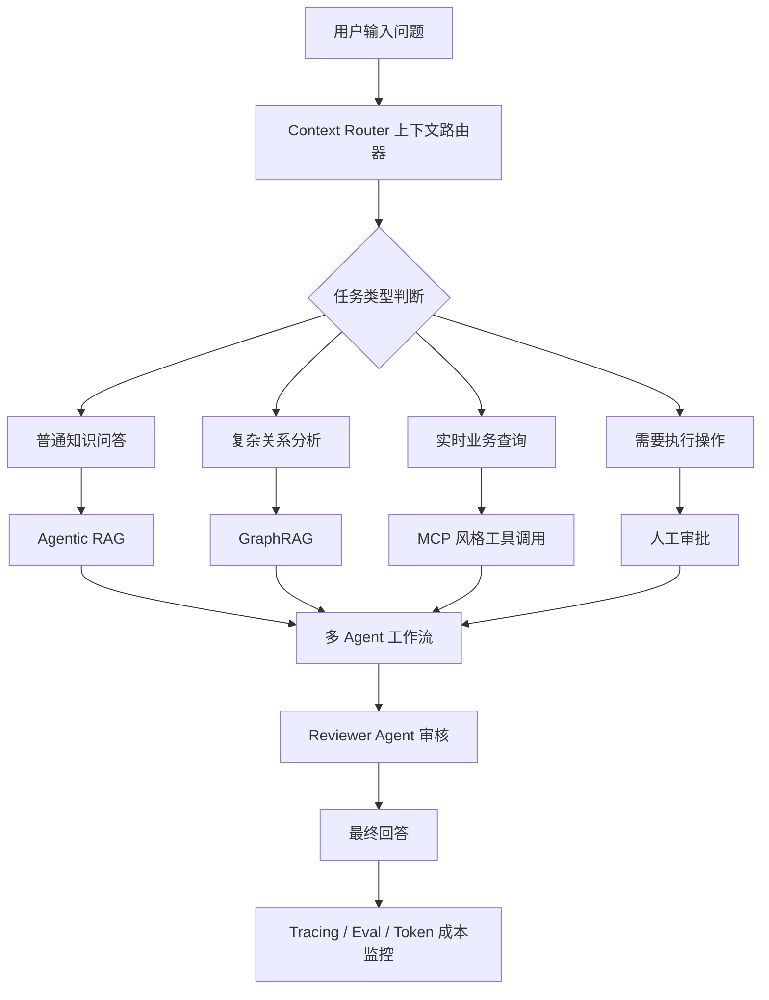

# 企业智能工单与知识助手平台项目说明

> 用途：这份文档用于记录项目目标、技术路线、阶段计划和后续开发要求。  
> 如果以后上下文丢失、开启新对话，直接把这份文档发给 AI，即可快速恢复项目方向。

## 1. 项目定位

项目名称：

```text
企业智能工单与知识助手平台
Enterprise AI Workflow Assistant
```

一句话目标：

```text
做一个企业内部 AI 助手，能阅读公司资料、理解业务关系、调用外部工具、处理工单，并且能被监控和评测。
```

这个项目不是普通聊天机器人，也不是简单 RAG 知识库。它更像一个企业内部的 AI 工作流中枢：

- 员工可以上传企业资料并提问。
- 系统可以从私有知识库中检索答案。
- 系统可以分析合同、项目、客户、工单之间的关系。
- 系统可以调用外部工具查询实时数据或创建工单。
- 高风险操作需要人工确认。
- 后台可以记录 Agent 执行轨迹、token 成本和回答质量。

最终项目可以包装成：

```text
企业级 Context Engineering 多 Agent 工作流平台
```

## 2. 项目要解决的业务问题

企业内部经常有这些问题：

- 新员工不知道制度、流程、接口文档在哪里。
- 客服和运维每天处理大量重复工单。
- 项目经理需要从合同、会议纪要、工单中分析项目风险。
- 业务人员不会 SQL，但经常需要查询业务数据。
- AI 回答是否可靠、是否有幻觉、是否能追溯来源，很难判断。
- AI 调用工具或执行操作时，需要权限控制和人工审批。

本项目的目标是把这些问题串成一个完整闭环：

```text
用户提问 -> 系统判断任务类型 -> 查文档/查图谱/调工具 -> 多 Agent 分工处理 -> 人工审批 -> 返回答案 -> 记录与评测
```

## 3. 典型演示场景

用户输入：

```text
客户 A 的项目为什么延期？相关合同有没有风险？要不要创建工单跟进？
```

系统执行流程：

1. 判断这是一个复杂业务问题，不是普通聊天。
2. 检索客户 A 的合同、会议纪要、历史工单。
3. 使用 GraphRAG 查找客户、合同、项目、负责人、工单之间的关系。
4. 调用工具查询当前工单状态。
5. 由 Risk Agent 判断延期和合同风险。
6. 由 Reviewer Agent 检查回答是否有证据来源。
7. 如果需要创建工单，先生成工单草稿。
8. 用户确认后，系统才真正创建工单。
9. 后台记录本次流程、工具调用、耗时、token 成本和最终回答。

最终输出应该包含：

- 延期原因
- 证据来源
- 相关合同条款
- 相关负责人
- 关联工单
- 风险等级
- 下一步建议
- 是否需要创建工单

## 4. 系统整体流程



用更简单的话解释：

```text
用户提问后，系统先判断问题类型。
如果是文档知识问题，走 RAG。
如果需要多轮检索，走 Agentic RAG。
如果涉及复杂关系，走 GraphRAG。
如果需要实时数据，调用工具。
如果要执行高风险操作，进入人工审批。
最后统一生成答案，并记录整个过程。
```

## 5. 核心技术点解释

### 5.1 RAG：让 AI 查询私有资料

RAG 的作用是让大模型基于企业自己的文档回答问题。

基础流程：

```text
上传文档 -> 解析文本 -> 文档切块 -> 生成 embedding -> 存入向量数据库 -> 用户提问 -> 检索相关片段 -> 生成回答
```

需要掌握的概念：

- chunk：文档切块。
- embedding：把文本变成向量。
- vector database：向量数据库，比如 pgvector。
- top-k retrieval：找最相似的几个文档片段。
- citation：回答时引用来源。

它解决的问题：

```text
大模型不知道企业私有知识。
```

### 5.2 Agentic RAG：会自己决定怎么查的 RAG

普通 RAG 是固定流程：

```text
提问 -> 检索 -> 回答
```

Agentic RAG 是智能流程：

```text
提问 -> 判断是否需要检索 -> 改写问题 -> 多轮检索 -> 判断资料是否足够 -> 回答
```

它解决的问题：

```text
普通 RAG 对复杂问题太死板，查一次可能查不准。
```

示例：

用户问：

```text
客户 A 延期的主要原因是什么？
```

Agentic RAG 可能自动拆解成：

- 查客户 A 的合同。
- 查项目延期记录。
- 查历史工单。
- 查会议纪要。
- 评估证据是否足够。
- 综合生成答案。

### 5.3 GraphRAG：让 AI 理解复杂关系

普通 RAG 擅长找相似文本，但不擅长找关系链。

GraphRAG 会从文档中抽取实体和关系：

```text
客户A -> 签署 -> 合同C
合同C -> 约定 -> 交付日期
项目P -> 负责人 -> 张三
项目P -> 关联 -> 工单T1001
工单T1001 -> 状态 -> 延期
```

它解决的问题：

```text
企业业务问题往往不是找一句话，而是找多个对象之间的关系。
```

适合场景：

- 合同风险分析
- 项目延期原因分析
- 客户关系分析
- 责任归属
- 事件溯源

新手第一版 GraphRAG 不需要做得很复杂，只需要能抽取常见实体和关系，并存入 Neo4j。

### 5.4 MCP 风格工具调用：让 AI 连接业务系统

RAG 只能查静态文档，但企业里很多问题需要实时系统。

例如：

- 查询工单状态
- 创建工单
- 查询数据库
- 查询 GitHub issue
- 发送通知

MCP 的思想是把这些能力包装成统一工具，让 Agent 可以调用。

新手阶段可以先不实现完整 MCP 协议，先做一个工具层：

```text
Tool: search_docs
Tool: query_ticket
Tool: create_ticket
Tool: query_project
Tool: query_customer
```

后续再升级为真正的 MCP server。

### 5.5 多 Agent 工作流：让不同角色分工

多 Agent 不应该是几个机器人互相聊天，而应该是明确岗位分工。

建议设计这些 Agent：

```text
Planner Agent：判断任务怎么拆。
Retriever Agent：查询知识库。
Graph Agent：查询关系图谱。
Tool Agent：调用外部工具。
Risk Agent：判断风险等级。
Reviewer Agent：检查回答是否可靠、是否有引用。
Executor Agent：执行创建工单等动作。
```

关键原则：

- 每个 Agent 职责单一。
- 每个 Agent 有明确输入和输出。
- 工作流由 LangGraph 或类似框架统一编排。
- 高风险动作必须进入人工审批。

### 5.6 Context Router：上下文路由器

Context Router 是本项目最核心的设计。

它负责判断用户问题应该走哪条路线：

```text
简单问题 -> 直接回答
企业文档问题 -> RAG
复杂文档问题 -> Agentic RAG
复杂关系问题 -> GraphRAG
实时业务问题 -> 工具调用
高风险操作 -> 人工审批
```

它体现的是 Context Engineering 思想：

```text
不是把所有东西都塞给模型，而是判断什么时候给模型什么上下文、给多少、怎么验证。
```

### 5.7 Human-in-the-loop：人工审批

企业 AI 不能随便执行高风险操作。

这些操作需要人工确认：

- 创建正式工单
- 修改数据库
- 发送邮件
- 标记合同高风险
- 关闭客户问题

流程：

```text
AI 生成建议 -> 用户查看 -> 用户确认 -> 系统执行
```

它解决的问题：

```text
AI 可以辅助决策，但关键动作必须可控。
```

### 5.8 Tracing、Eval 和 Token 成本监控

企业级 AI 系统不能只看最终回答，还要能回放过程。

需要记录：

- 用户问题
- 任务分类结果
- 调用了哪些 Agent
- 检索了哪些文档
- 调用了哪些工具
- 每一步耗时
- 每一步 token 成本
- 最终回答
- 用户反馈
- 是否失败

后台可以展示这些指标：

- 回答准确率
- 检索命中率
- 工具调用成功率
- 平均响应时间
- 平均 token 成本
- 失败案例数量

## 6. 推荐技术栈

```text
前端：Next.js + Tailwind CSS
后端：FastAPI
主数据库：PostgreSQL
向量检索：pgvector
图数据库：Neo4j
Agent 编排：LangGraph
缓存/队列：Redis
异步任务：Celery
文档解析：PyMuPDF / unstructured
大模型接口：OpenAI API 或兼容接口
部署：Docker Compose
```

> ⚠️ 说明：以上是**生产化目标栈**，不是当前实现。当前学习版（V1–V5）实际使用：FastAPI + SQLite + React/Vite、本地哈希 embedding、规则式图谱（SQLite 两表 + BFS）、自研显式状态机（节点契约对齐 LangGraph，可迁移）。简历与对外表述一律以实际实现为准（见第 10 节）。

选择理由：

- FastAPI：Python 生态适合 AI 应用开发。
- Next.js：适合做聊天界面和管理后台。
- PostgreSQL + pgvector：既能存业务数据，又能做向量检索。
- Neo4j：适合展示和查询实体关系图。
- LangGraph：适合编排多 Agent 工作流。
- Docker Compose：方便把数据库、后端、前端、Redis、Neo4j 一起启动。

## 7. 分阶段开发路线

### V1：知识库问答系统

目标：

```text
用户上传文档，AI 可以基于文档回答问题，并显示来源。
```

功能：

- 用户登录
- 文档上传
- 文档解析
- 文档切块
- embedding 生成
- 向量存储
- 问答接口
- 来源引用

学习重点：

- FastAPI
- 文件上传
- 文档解析
- embedding
- pgvector
- LLM API 调用
- 基础前端页面

### V2：Agentic RAG

状态：2026-07-20 已完成学习版闭环。

目标：

```text
AI 不再只检索一次，而是能判断怎么查、是否需要重查、资料是否足够。
```

新增功能：

- 问题分类
- query 改写
- 多轮检索
- 检索结果评分
- 无答案时拒答
- 回答前检查引用

当前实现映射：

```text
Router Agent    -> 问题分类与复杂度判断
Planner Agent   -> query 改写、拆解和检索计划
Retriever Agent -> keyword / embedding / hybrid 一到两轮检索
Evidence Agent  -> 分数、意图覆盖率和主题锚点检查
Answer Agent    -> local / API / auto 回答
Reviewer Agent  -> 拒答决策与标准来源引用审核
```

说明：当前使用显式 Python 状态机实现节点和状态流转，便于初学者理解；节点契约已经独立，后续可平滑迁移到 LangGraph。

学习重点：

- LangGraph 工作流
- Agent 状态管理
- 检索质量判断
- 防幻觉策略

### V3：工具调用与工单系统

目标：

```text
AI 可以查询工单、创建工单，进入真实业务流程。
```

新增功能：

- 内置工单模块
- 查询工单工具
- 创建工单工具
- 更新工单状态
- 工具调用日志
- 人工确认按钮

学习重点：

- 工具调用
- 业务数据库设计
- 权限控制
- Human-in-the-loop

### V4：GraphRAG 关系分析

目标：

```text
AI 可以从文档中抽取实体和关系，并支持复杂业务关系分析。
```

新增功能：

- 实体抽取
- 关系抽取
- Neo4j 存储
- 关系图展示
- 关系链查询
- 风险分析

学习重点：

- 知识图谱基础
- Neo4j / Cypher
- 实体关系建模
- 跨文档推理

### V5：评测、监控和成本面板

目标：

```text
让整个 AI 系统可观察、可评测、可优化。
```

新增功能：

- Agent 执行轨迹
- 工具调用记录
- token 成本统计
- 响应时间统计
- 检索命中率
- 用户反馈
- 失败案例回放
- prompt 版本管理

学习重点：

- AI eval
- observability
- prompt 版本管理
- 质量优化

## 8. 推荐项目目录结构

```text
enterprise-ai-workflow-assistant/
  apps/
    web/                 前端 Next.js
    api/                 后端 FastAPI

  packages/
    agents/              多 Agent 定义
    rag/                 RAG 检索逻辑
    graph/               GraphRAG 逻辑
    tools/               工具调用层
    evals/               评测逻辑

  infra/
    docker-compose.yml
    postgres/
    neo4j/
    redis/

  docs/
    architecture.md
    api.md
    agent-workflow.md
    demo-script.md
```

## 9. 最终作品集应展示的内容

不要只展示代码，最好准备这些材料：

- README
- 系统架构图
- 演示视频
- 模拟企业文档
- 完整 demo 流程
- 后台截图
- 技术难点总结
- 未来优化方向

推荐 demo：

```text
上传客户合同、项目会议纪要、历史工单。
用户提问：客户 A 项目为什么延期？有没有合同风险？请帮我生成跟进工单。
系统自动查文档、查图谱、查工单，生成风险分析和工单草稿。
用户确认后创建工单。
后台展示 Agent 执行轨迹和 token 成本。
```

## 10. 简历描述模板

项目名称：

```text
企业级 AI 工作流助手平台
```

项目描述：

> 原则：写实际做出来的东西。当前项目**没有**使用 LangGraph、Neo4j、pgvector、Next.js，简历里不要写这些框架名，否则面试一问就穿帮；把"学习版 + 可迁移"如实写出来反而是加分项（说明懂取舍）。

```text
独立设计并实现企业级 AI 工作流助手（V1–V5 学习版闭环），支持私有知识库问答、Agentic RAG 多轮检索与三层证据门控、学习版 GraphRAG 关系分析、受控工具调用与人工审批（原子 claim ownership + 幂等）、执行轨迹回放和 token 成本监控。系统基于 FastAPI、SQLite 与 React/Vite 构建，自研显式状态机编排多 Agent 节点（节点契约对齐 LangGraph，可直接迁移），可选接入 DeepSeek/OpenAI API，可用于企业内部工单处理、合同风险分析和知识检索场景。
```

技术亮点：

- 设计 Context Router，根据用户问题动态选择 RAG、GraphRAG、工具调用或人工审批流程。
- 实现 keyword / 本地 embedding / hybrid 三通道检索与 RRF 融合，检索质量由离线评测门禁与 70+ 回归测试保障（存储层契约对齐 pgvector，可平滑迁移）。
- 用独立节点契约的显式状态机编排 Planner / Retriever / Evidence / Graph / Tool / Answer / Reviewer 七类 Agent 节点，多轮检索 + 分数/意图覆盖/主题锚点三层证据门控防幻觉。
- 用 SQLite 两表 + 规则抽取 + BFS 实现学习版 GraphRAG（契约对齐 Neo4j/Cypher，后续可替换为 LLM 抽取与图数据库）。
- 实现受控工具层：JSON Schema 校验、读写分离、幂等键 + 原子 claim ownership + TTL 的人工审批；进程内并发只允许 claim owner 执行，外部副作用需下游幂等键。
- 设计 Agent tracing 面板，记录工具调用、响应耗时、token 成本和失败案例，支持失败回放与用户反馈闭环。

## 11. 后续开发时的接续提示

如果以后开新对话，可以直接复制下面这段给 AI：

```text
我正在做一个名为“企业智能工单与知识助手平台”的项目，V1–V5 学习版闭环已完成并全部通过评测门禁。

当前真实技术栈：FastAPI + SQLite + React/Vite；本地哈希/真实 embedding + keyword/hybrid 检索；规则式图谱（SQLite 两表 + BFS）；自研显式状态机编排 Agent 节点；受控工具层 + 人工审批（单一 claim owner + 幂等）；trace/token 成本/反馈观测闭环。可选接入 DeepSeek/OpenAI API。

项目核心能力包括：
1. RAG 私有知识库问答（三通道检索 + RRF）。
2. Agentic RAG 多轮检索、三层证据门控防幻觉。
3. 学习版 GraphRAG 实体关系分析与风险链路。
4. 受控工具调用（查询/创建/更新工单）+ Human-in-the-loop 审批。
5. 显式状态机编排 Planner/Retriever/Evidence/Graph/Tool/Answer/Reviewer 节点（契约对齐 LangGraph）。
6. Tracing、离线评测门禁（V2–V5）与 token 成本监控。

下一步按 docs/engineering-optimization.md 的 P0→P1→P2 顺序推进生产化（鉴权/租户 → PostgreSQL+pgvector → 真实 embedding → LangGraph → LLM 抽取图谱 → 流式+队列 → OTel → Docker/CI）。请先阅读 README.md 与 docs/project-report.md 恢复上下文。
```

## 12. 当前最建议先做的第一步

第一步不要急着做多 Agent、GraphRAG 或 MCP。

当前最合理的开发目标是：

```text
完成 V1：知识库问答系统。
```

V1 的验收标准：

- 可以上传一个 PDF / TXT / Markdown 文件。
- 后端能提取文本。
- 能把文本切成多个 chunk。
- 能生成 embedding。
- 能把 chunk 和 embedding 存入 PostgreSQL + pgvector。
- 用户可以输入问题。
- 系统能检索相关 chunk。
- 大模型能基于 chunk 回答。
- 回答能显示来源。

完成 V1 后，再升级到 V2：Agentic RAG。
