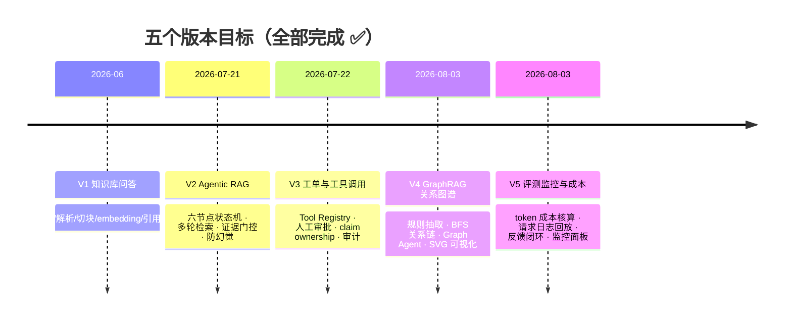
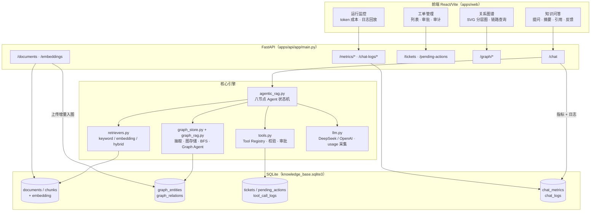
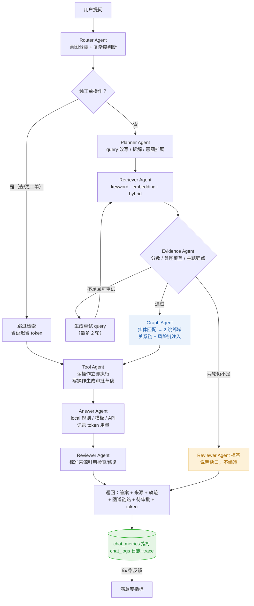
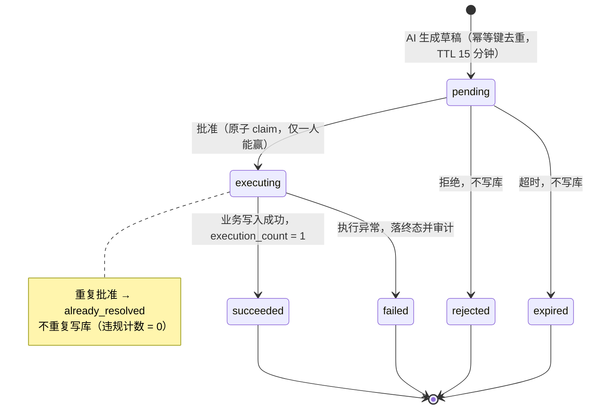
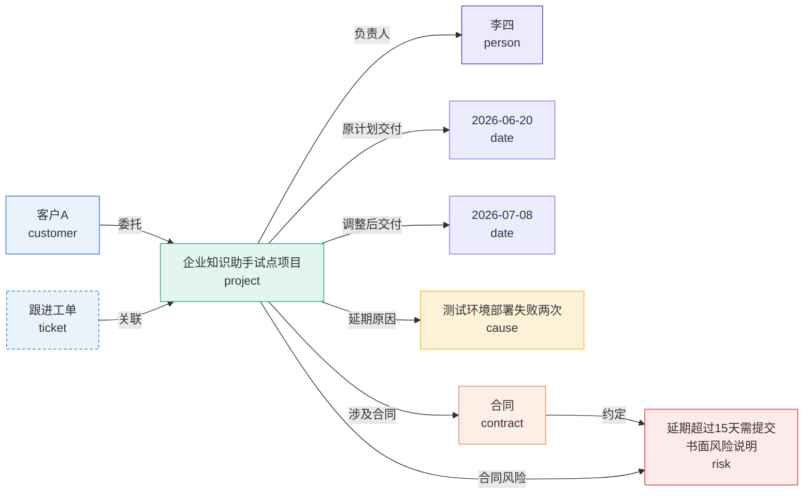
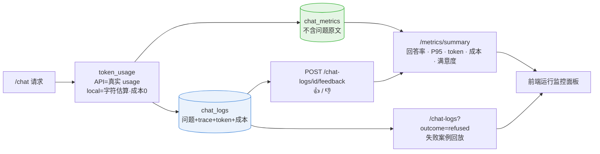
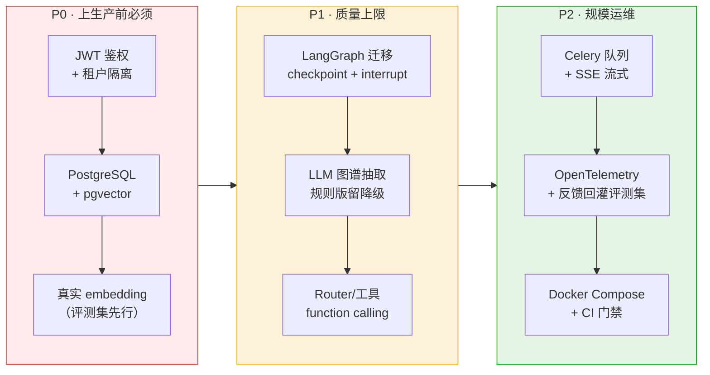

# 项目总结报告：架构 · 工作流 · 指标 · 路线

> Enterprise AI Workflow Assistant（企业智能工单与知识助手平台）
> 更新：2026-08-04 · 状态：**V1–V5 全部收口，四道质量门禁全绿**
> 阅读方式：本文所有图为 Mermaid，GitHub / VS Code Markdown 预览可直接渲染。

---

## 1. 一页看懂项目

| | |
| --- | --- |
| 一句话 | 企业内部 AI 工作流中枢：读资料、理关系、调工具、办工单，全程可审批、可追溯、可评测 |
| 技术栈 | FastAPI + SQLite + React/Vite，本地学习版 embedding 与规则图谱，DeepSeek/OpenAI 可选接入 |
| 规模 | 后端领域模块 + 前端 4 个 feature / 30+ API 端点 / 77 个回归测试 / 5 道离线评测门禁 |
| 验收入口 | `.\scripts\context-harness.ps1 -Mode verify`（编译 → 测试 → 冒烟 → V2–V5 门禁 → 前端构建） |

### 版本演进



---

## 2. 系统架构



---

## 3. Agentic 工作流（一次 /chat 的完整路径）



**防幻觉三道闸**：证据分数不足拒答 → 意图覆盖率不足拒答 → 主题锚点不匹配拒答（高分但答非所问也拦截）。

---

## 4. 写操作审批状态机（V3，单一 claim owner 执行）



---

## 5. V4 关系图谱：真实语料抽取效果

对 `sample-project-delay-cn.pdf`（字段连排的脏文本）实际抽出的图：



关键设计：每条关系都带**证据句 + 文档/chunk 溯源**；风险类关系（延期原因/合同风险/约定）单独组成**风险链路**注入回答；BFS 支持最多 4 跳链路查询（如 `客户A → 委托 → 项目 → 负责人 → 李四`）。

---

## 6. V5 观测数据流



隐私分层：`chat_metrics`（聚合指标）刻意不存问题原文；`chat_logs`（回放）单独存放，生产上可独立设保留期与脱敏策略。

---

## 7. 性能指标验证（2026-08-03 实测）

### 五道离线门禁（`context-harness.ps1 -Mode verify` 一次通过）

| 门禁 | 检查项 | 门槛 | 实测 | 结果 |
| --- | --- | --- | --- | :---: |
| **V2** Agentic RAG | 意图 / 答拒 / 轮次 / 引用准确率 | ≥90% / ≥90% / ≥90% / 100% | 全部 **100%** | ✅ |
| | 端到端延迟 | P95 ≤ 100ms | **13.9ms** | ✅ |
| **V3** 受控工具 | 安全检查（草稿不写库/拒绝/过期/校验/权限） | 7/7 = 100% | **100%** | ✅ |
| | 重复执行违规 | = 0 | **0** | ✅ |
| | 工具执行延迟 | P95 ≤ 200ms | **19.9ms** | ✅ |
| **V4** GraphRAG | 实体召回 / 关系召回 | ≥90% / ≥90% | **100% / 100%** | ✅ |
| | 结构检查（链路/风险链/工单连边/Agent 接入） | 6/6 = 100% | **100%** | ✅ |
| | 图查询延迟 | P95 ≤ 50ms | **10.8ms** | ✅ |
| **V5** 观测闭环 | 8 项检查（日志/回放/反馈/token/成本字段） | 8/8 = 100% | **100%** | ✅ |
| | 对话延迟（含日志写入） | P95 ≤ 300ms | **28.2ms** | ✅ |
| **V6** 黄金集 | 42 条标注问答：decision / recall3 / fact（hybrid） | ≥90% / ≥75% / ≥70% | **98% / 97% / 97%** | ✅ |
| | keyword / embedding 模式同步达标 | decision ≥ 90% | **98% / 98%** | ✅ |

### 真实服务在线验证（uvicorn + 真实语料）

| 场景 | 结果 |
| --- | --- |
| 图谱全量重建 | 10 实体 / 8 关系，耗时 **24.7ms** |
| "甲方客户A的项目为什么延期？" | HTTP 延迟 **25.4ms**；Graph Agent 命中，6 条关系链注入回答；token 336 |
| 链路查询 客户A → 李四 | `客户A —委托→ 项目 —负责人→ 李四`（2 跳） |
| 反馈闭环 | 👍 写入后满意度指标即时更新 |

### 回归测试矩阵（77 个，全部通过）

| 测试文件 | 覆盖 | 数量 |
| --- | --- | :---: |
| test_agentic_rag.py | 分类 / 改写 / 轮次 / 拒答 / 主题锚点 | 6 |
| test_api_contract.py | /chat 契约、standard 兼容、指标契约 | 4 |
| test_metrics.py | 指标聚合、隐私（无问题原文） | 2 |
| test_v3_tools.py | 审批幂等 / 拒绝过期 / 权限校验 / 失败终态 | 6 |
| test_graph_rag.py | 抽取 / 图存储 / 链路 / Graph Agent / 删除清理 | 10 |
| test_v5_observability.py | token 核算 / 日志 / 回放 / 反馈 / 图谱端点契约 | 8 |
| test_p0_hardening.py | P0 加固：上传 413 / 上下文注入 / WAL / 按 provider 计费 | 9 |
| test_embedding_v2.py | A3：真实 embedding 入库 / 哈希回退 / reranker 重排 | 9 |
| test_chunking.py | A4：标题层级链 / 句子边界 / 超长句硬切 | 5 |
| test_llm_router.py | B1/B2/B3：LLM 路由规划工具选择（规则降级）+ 声明溯源 | 13 |
| test_p1_p2_hardening.py | 原子知识写入 / 图谱回滚 / revision 缓存 / LLM client / 并发审批 | 5 |

> 注：以上延迟均为本地 local 模式、小语料（演示级）基线，代表工程正确性而非生产容量；接入真实 LLM 后 P95 门槛需按 SLA 口径重设（见第 9 节）。

---

## 8. API 端点地图

| 模块 | 端点 | 说明 |
| --- | --- | --- |
| 问答 | `POST /chat` | standard / agentic 工作流，返回答案+来源+轨迹+图谱链路+token+log_id |
| 文档 | `GET/POST/DELETE /documents` · `/embeddings/*` | 上传自动切块、建向量、**增量入图** |
| 工单 | `GET/POST/DELETE /tickets` · `/tickets/{id}/status-draft` | 手动写需 operator/admin；AI 写走审批 |
| 审批 | `GET /pending-actions` · `POST /pending-actions/{id}/approve` | 原子批准/拒绝，幂等 |
| 图谱 | `GET /graph/overview·entities·relations·paths` · `POST /graph/rebuild` | 概览/检索/BFS 链路/全量重建 |
| 观测 | `GET /metrics/summary·tools` · `GET /tool-calls` | 运行指标、工具指标、审计 |
| 日志 | `GET /chat-logs[/{id}]` · `POST /chat-logs/{id}/feedback` | 失败回放（含 trace）、用户反馈 |

---

## 9. 工程化落地路线（生产化改造顺序）

> 完整论证见 [engineering-optimization.md](./engineering-optimization.md)，此处为可视化摘要。



| 优先级 | 改造 | 解决的问题 | 回归标准 |
| :---: | --- | --- | --- |
| P0 | JWT/OIDC + tenant_id | `X-User-Role` 自报角色仅是演示 | 跨租户读写 100% 拒绝 |
| P0 | PostgreSQL + pgvector | SQLite 写并发受限、每 revision 首次装载 | 并发压测只允许 claim owner 执行，外部调用透传幂等键 |
| P0 | 真实 embedding（BGE-m3 等） | 哈希 n-gram 只有字符重合意义 | 50+ 条评测集上 Top-3 命中率超基线 |
| P1 | LangGraph | 崩溃恢复、审批可挂起工作流 | 77 测试 + 五门禁全绿 |
| P1 | LLM 抽取图谱 | 正则规则换语料要改代码 | 标注集召回 ≥ 85% |
| P2 | 队列 + 流式 + OTel + CI | 上传阻塞、指标孤岛、手工发布 | CI 内四门禁强制通过 |

**明确不做**：语料上规模前不上 Neo4j（BFS+SQLite 当前量级更优）；没有评测基线不换模型（门禁先行是本项目方法论）；指标表与日志表不合并（隐私分层是刻意设计）。

---

## 10. 快速上手

```powershell
# 后端
cd "D:\multi agents\apps\api"
uvicorn app.main:app --reload --port 8000

# 前端（另开终端）
cd "D:\multi agents\apps\web"
npm run dev          # http://127.0.0.1:5173

# 一键验收（编译 → 77 测试 → 冒烟 → V2-V6 门禁 → 前端构建）
cd "D:\multi agents"
.\scripts\context-harness.ps1 -Mode verify
```

演示脚本：上传 `docs/sample-project-delay-cn.pdf` → 问"甲方客户A的项目为什么延期？要不要创建工单跟进？" → 看图谱链路与工单草稿 → 审批面板批准 → 运行监控查看 token、日志回放并点 👍。
