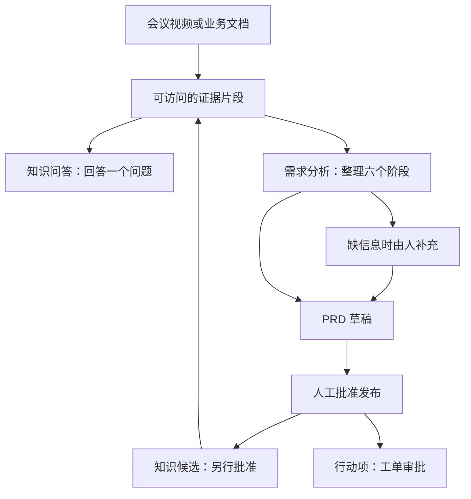

# Enterprise Insight Platform：从一个例子理解项目

这个项目帮助产品经理把会议视频和业务文档，整理成**有来源可核对的回答、可评审的产品需求文档，以及经过批准的行动项**。产品需求文档简称 PRD，用来说明“做什么、为什么做、怎样验收”。

先读完本文，再实际走一次流程即可。框架比较、部署细节和完整代码地图放在文末按需阅读，不需要先学完整个技术栈。

## 1. 用一件具体的事串起来

假设客户在需求会上提出：“审批系统需要导出审计报表。”会议视频和配套文档里有申请时间、申请人、审批结果等字段，但没有说明最终由谁拍板、怎样算验收通过。

平台要帮助你找到这些材料，整理需求，并把未确定的事情交给人决定。下面的例子用于说明流程；本机模拟转写不会真的识别上传视频中的讲话。



图里问答和分析是两个入口。你可以先问清楚再分析，也可以直接创建分析；聊天记录不会自动成为需求分析的证据。

### 第一步：把材料放进当前工作区

登录后先看顶部的 **Workspace（工作区）**。个人工作区里的资料只归本人使用；团队工作区里的资料可由有权限的成员共同读取。切换工作区会切换整套资料范围，后端负责检查权限。

- 在“视频证据”上传会议视频，查看处理进度，选中要使用的视频。转写结果带视频身份和时间段，后续可以回放核对。
- 在“知识问答”的“文档管理”上传 TXT、Markdown 或 PDF。第一次体验推荐先用内容明确的文本文件，方便逐句核对结果。

例如，可以自行准备一份 `需求记录.md`：

```text
客户A希望在审批系统中导出审计报表。
报表包含申请时间、申请人和审批结果。
当前缺少导出接口，存在排期风险。
优先级为 P1。
```

系统把资料切成适合检索的小段，代码中叫 **chunk**。证据是在这些段落上保留文件名、原文、所属工作区等信息；视频证据还保留时间段。切分、存储和索引都不会训练出一个新模型。

### 第二步：用“知识问答”解决一个问题

输入：“客户A的审计报表包含哪些字段？”

系统先检查你能读什么，再找相关片段，最后组织回答并展示来源。这就是 **RAG**：先查资料，再据此回答。点击视频来源可以跳到相应时间；文档来源展示原文片段。

页面中的两种工作流都服务于问答：

| 问答模式 | 主要区别 |
| --- | --- |
| 标准 RAG | 按既定流程检索、检查证据、组织回答 |
| Agentic RAG | 增加意图判断、执行计划、受限的补充检索或工具选择 |

Agentic RAG 也有规则边界和调用预算。它与下一步的“六阶段需求分析”是两条不同流程。连续追问可以使用主题提示，但每轮仍须重新取得当前有权限的证据，不能把上次生成的答案当成新的事实。

### 第三步：用“需求分析”组织一份交付物

进入“需求分析”，填写目标：“基于客户A的材料，整理审计报表导出需求。”

创建时，系统根据目标检索授权证据并**冻结这次选中的材料**。可以把冻结理解为“本次评审使用的材料版本”：后来有人上传新文件，也不会悄悄改变这份分析。

六个阶段不是六个聊天机器人，而是六项明确的工作：

| 阶段 | 用这个例子理解 |
| --- | --- |
| 1. 意图识别 | 明确这次要整理“审计报表导出需求” |
| 2. 干系人 | 从材料中找客户、产品、研发等参与者 |
| 3. 领域深挖 | 分别看业务、数据安全、技术集成、规则合规 |
| 4. 异常与风险 | 找材料中明确出现的依赖、冲突或排期风险 |
| 5. 收敛检查 | 检查决策人、验收口径、优先级等是否还缺信息 |
| 6. PRD 草稿 | 把需求、验收条件、风险和来源整理成草稿 |

这个例子缺少决策人和验收条件，流程会要求人工补充。填写的是你的业务决定，应如实说明，不能假装它原本出现在客户材料中。

点击“确认并继续”时，系统保留前四阶段和冻结证据，从收敛检查继续；如果仍缺信息，就再次等待。如果最初没有找到可用证据，需要选好材料后新建分析，单靠补充文字不能扩大冻结范围。

### 第四步：批准发布，再决定知识和行动

PRD 草稿可以评审；发布需要单独操作。个人工作区由 OWNER 再次明确确认，团队工作区则由符合权限的另一成员审批，提交者不能批准自己的 PRD。

发布后保存不可覆盖的版本，并派生两类交付物：

| 交付物 | 你还需要做什么 | 完成后的用途 |
| --- | --- | --- |
| 知识候选 | 在“发布交付物”中审阅并另行批准 | 成为可被未来问答检索的已批准知识，保留原 PRD 与证据来源 |
| 行动项草稿 | 送入工单审批，由授权用户决定 | 建立可跟踪的工单，结果回写到交付物 |

例如，“报表需要包含审批结果”可作为知识候选；“研发评估导出接口”可成为行动项。PRD 发布不会自动代表这两类内容都已批准。

知识以后发现错误，可以申请替代或撤回；旧版本留在历史里，未来检索只使用活跃版本。“工单管理”跟踪执行，“关系图谱”辅助查看资料间关系，“运行监控”帮助排查流程。

## 2. 系统里谁在做这些事

整个项目只有**一个前端、两个后端**。理解这三个分工，比先背所有框架名有用。

| 部分 | 通俗职责 | 本项目负责的事情 |
| --- | --- | --- |
| React 前端 | 用户操作台 | 登录、选材料、提问、查看阶段、审批、回放证据 |
| Java / Spring Boot 的 Media Service | 管好身份和视频 | 账号与工作区、上传、媒体处理、转写、播放授权 |
| Python / FastAPI 的 Agent Service | 使用证据完成业务 | 文档摄取、检索、问答、分析、PRD、知识与工单审批 |

视频处理完成后，Media Service 把转写事件通过 HTTP 送给 Agent Service。它先把待发送记录保存到数据库，失败可以重试；接收方识别重复事件，避免重复入库。这是**两个后端之间的通信**。

Agent Service 内部的领域分析，则是 Python 函数读取同一份证据、返回结构化结果。这是**一个服务内部的协作**，不需要为每个“Agent”启动一个服务或一套消息队列。

两个后端各自保存自己的数据，不直接改对方的数据库。前端可以合并展示进度，但“视频处理失败”和“分析等待确认”仍是两件不同的事。

## 3. LangGraph 在哪里，用它解决什么

LangGraph 在 Python 后端里安排“先做哪一步、下一步走哪里”。它是程序中使用的库，无需单独启动一台 LangGraph 服务。

六阶段分析已经在源码中接入 LangGraph。只需要先掌握三个概念：

| 概念 | 在项目里对应什么 |
| --- | --- |
| State：状态 | 本次目标、冻结证据、阶段结果、人工补充、待确认问题 |
| Node：节点 | 执行一个阶段的普通 Python 函数 |
| Edge：边 | 阶段顺序，以及“继续生成草稿还是等待补充”的分支 |

规则、检索、模型 SDK 和审批代码继续承担原有职责；LangGraph 组织这些函数。首阶段复用现有业务数据库保存等待状态，不新增框架自己的检查点数据库，也不使用原生 `interrupt`。确认时重新建立图的输入并从收敛阶段执行，不能理解为恢复某次模型调用的中间状态。

六个节点和流程图都在现有 [analysis_pipeline.py](../services/agent-service/app/analysis_pipeline.py) 中，旧的手工阶段调度已被替换。缺信息时结束本次图执行，由业务数据库保存等待状态；下一次确认请求从收敛节点继续。程序只缓存流程结构，每次请求分别建立输入，不把上一个人的分析状态交给下一个人。

本次精简的是需要自行理解和维护的编排约定，新增框架仍会增加依赖包。框架比较与接法集中在 [ADR-0020](../knowledge/decisions/0020-langgraph-application-report.md)，验证记录查 [QUALITY](../knowledge/QUALITY.md)。源码接入与当前容器版本分开记录，在线运行情况查 [OPERATIONS](../knowledge/OPERATIONS.md)。

LangGraph 的“图”表示**执行顺序**；界面里的“关系图谱”表示**业务资料之间的实体关系**。名字相似，职责不同。

## 4. 哪些步骤用了模型，哪些只是规则

代码中出现“Agent”这个名字，不代表一定调用大模型。判断时要看该步骤的实现和当次配置。

| 步骤 | 当前实现应怎样理解 |
| --- | --- |
| 问答意图判断、计划、工具选择 | 可调用模型；不支持或失败时有规则路径 |
| 问答答案组织 | API 模式可调用配置的模型；local 模式使用本地规则与模板 |
| 六阶段分析与四个领域 specialist | 当前依据文本规则提取、检查和构造草稿；接入 LangGraph 不会自动把它们变成 LLM |
| 引用 Reviewer | 规则检查引用样式和部分数字锚点，不是独立模型对每句话做事实核验 |
| 权限、状态变更、审批 | 后端代码与数据库执行，不由模型说了算 |
| 视频转写、媒体摘要 | 有真实调用适配，也有本机演示使用的 mock 路径，运行模式需单独核对 |

仍需记住两条边界：规则 specialist 的异常可以转为待人工复核，但永久卡住仍可能阻塞；来源引用有助于核对，却不保证每句话都正确。框架选型没有替代超时保护或事实验证，相关实现边界见 [面试指南](INTERVIEW_GUIDE.md)。

## 5. 先掌握最小运行方式

日常理解项目，先用 [轻量本地栈](../compose.local.yml)：一个 Web 容器、一个 Media 容器、一个 Agent 容器。数据分别保存在本机 H2、SQLite 和媒体目录里，不需要启动独立数据库服务。

本地启动入口在仓库根目录：

```powershell
./scripts/start_local.ps1 -Build
```

浏览器默认打开 [http://127.0.0.1:8080](http://127.0.0.1:8080)。已有部署、数据备份和升级操作按 [本地发布手册](LOCAL_RELEASE_RUNBOOK.md) 处理；源码更新不会自动更新已经运行的容器。

| 现在要掌握 | 学到什么程度即可 |
| --- | --- |
| React + TypeScript | 知道页面怎样发请求、展示状态和收集表单 |
| FastAPI + Pydantic | 知道接口怎样接收请求、校验结构、调用业务函数 |
| LangGraph | 能读懂状态、六个节点和条件分支 |
| Spring Boot | 能跟踪登录、上传、媒体任务和转写事件 |
| SQL 与本地数据库 | 能解释数据如何保存，以及审批怎样避免重复提交 |
| Docker Compose | 会启动、查看日志、停止现有三个容器 |

轻量栈默认使用 mock 转写/摘要、local 回答和关键词检索。它适合核对完整业务流程；模拟转写质量、模板回答效果不能当成真实模型效果。hash 向量同样只是确定性测试路径，不能当作真实语义模型评测。

下面这些是已有扩展，先知道用途即可，暂时不用一起学习或运行：

| 扩展方向 | 已有组件及用途 |
| --- | --- |
| 真实 AI 能力 | 现有模型 SDK、真实转写、可选 embedding / reranker；分别负责生成、语音识别、语义检索和精排 |
| 共享基础设施 | MySQL 保存业务数据；Redis 支撑共享协调；RocketMQ 支撑媒体任务投递 |
| 身份与对象存储 | Keycloak 对接企业登录；MinIO / S3 适配媒体对象存储 |
| 可靠性验证 | 准生产 Compose、故障注入、压测与恢复演练 |

这些扩展保留在项目中，是否启用由环境和需求决定。当前部署模式查 [OPERATIONS](../knowledge/OPERATIONS.md)，最新测试与真实集成范围查 [QUALITY](../knowledge/QUALITY.md)，本文不复制容易过期的测试数量或性能数字。

## 6. 两种“知识库”不要混淆

| 名称 | 保存什么 | 给谁使用 |
| --- | --- | --- |
| 产品里的业务知识库 | 用户上传资料、视频转写、人工批准的知识 | 当前工作区的用户，用于问答和分析 |
| 仓库里的 `knowledge/` | 产品边界、架构、运行方法、决策与验证记录 | 开发者和维护助手，用于理解项目 |

仓库维护知识的语义索引只帮助定位文档，不参加客户问答，也不是用户的业务向量库。维护时以 [knowledge/INDEX.md](../knowledge/INDEX.md) 找事实；`knowledge/generated/` 由脚本生成，不需要手读向量或直接修改。

## 7. 真要读代码时，先只追一条分析请求

按下面顺序读，能把页面操作和后端行为对上即可：

| 顺序 | 看哪里 | 要回答的问题 |
| --- | --- | --- |
| 1 | [需求分析页面](../apps/web/src/features/AnalysisWorkspace.tsx) | 点击“开始分析”“确认并继续”分别提交了什么？ |
| 2 | [分析 HTTP 接口](../services/agent-service/app/routes/analysis.py) | 谁能创建、恢复、查看和发布这份分析？ |
| 3 | [分析证据](../services/agent-service/app/analysis_evidence.py) | 证据怎样授权、排序并冻结？ |
| 4 | [六节点流程图与分析函数](../services/agent-service/app/analysis_pipeline.py) | `_AnalysisState` 传什么，六阶段怎么执行，缺信息时走哪个分支？ |
| 5 | [分析状态存储](../services/agent-service/app/analysis_store.py) | 等待后怎样恢复，重复确认为什么不能提交两次？ |
| 6 | [PRD 发布](../services/agent-service/app/publication_service.py) | 草稿怎样经过批准成为不可变版本？ |

对应的回归入口是 [分析流程测试](../services/agent-service/tests/test_analysis_workflow.py) 和 [PRD 评测](../quality/agent-evals/evaluate_prd.py)。先理解一个成功路径，再读等待、并发确认和权限失败的用例。

有具体问题时，再补充其他模块：

| 想了解的问题 | 入口 |
| --- | --- |
| 视频上传后为什么还没完成？ | [媒体任务入口](../services/media-service/src/main/java/com/example/videoplatform/workflow/VideoTaskService.java)、[转写事件投递](../services/media-service/src/main/java/com/example/videoplatform/integration/AgentOutboxDispatcher.java) |
| 问答怎样取得证据、处理连续追问？ | [会话服务](../services/agent-service/app/chat_service.py)、[检索器](../services/agent-service/app/retrievers.py) |
| 已批准知识怎样替代、撤回？ | [知识生命周期](../services/agent-service/app/knowledge_lifecycle_store.py) |
| 工单为什么需要先审批？ | [受控工具执行](../services/agent-service/app/tools.py)、[工单状态存储](../services/agent-service/app/ticket_store.py) |
| 其他页面和模块在哪里？ | [前端路由](../apps/web/src/App.tsx)、[完整架构映射](ARCHITECTURE_PANORAMA.md) |

## 8. 接下来按这个顺序学

1. **会使用：**按本文走“上传文档 → 问答核对来源 → 创建分析 → 补充 → 审批”。需要演示话术再读 [演示脚本](DEMO_SCRIPT.md)。
2. **会解释：**沿上一节六个入口追一条分析请求，能说清材料、证据、草稿和已发布版本的区别。
3. **会答辩：**读 [面试指南](INTERVIEW_GUIDE.md)；框架为什么选 LangGraph、以后何时扩展，集中看 [ADR-0020](../knowledge/decisions/0020-langgraph-application-report.md)。
4. **会维护：**带着具体问题查 [知识路由](../knowledge/INDEX.md)，按 [维护工作流](../skills/enterprise-insight-maintainer/references/maintenance-workflow.md) 跑相应验证。

首次阅读可以跳过历史归档、旧版评测演进、准生产部署和完整模块清单。先能独立讲清一个例子、定位一条请求，再展开下一块。
