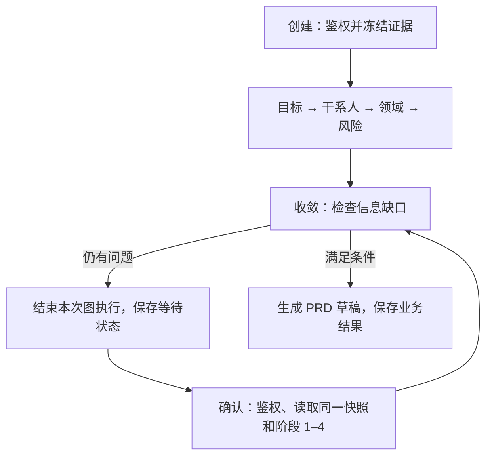

# LangGraph 应用与框架选型报告（ADR-0020）

- 日期：2026-09-15；本次实施基线：`5b48f7d`。
- 状态：**B 阶段已实施六节点图**；最新验证统一记录在 [QUALITY](../QUALITY.md)。运行中容器是否更新以 [OPERATIONS](../OPERATIONS.md) 为准。
- 范围：Agent Service 六阶段分析；延续 [ADR-0009](0009-objective-evidence-checkpoint-and-specialists.md) 的证据、业务检查点与审批语义，以及 [ADR-0015](0015-agent-service-bounded-context-facades.md) 的模块边界。

## 1. 为什么选 LangGraph

当前流程需要固定阶段、明确分支和人工补充后的继续执行。LangGraph 的 StateGraph 能直接连接已有 Python 函数，规则步骤无需改写成调用模型的 Agent。本次只使用 **State、Node、Edge**；等待与恢复仍使用现有业务检查点。[S1]

以下比较的是对本项目的适配程度。官方能力与维护状态沿用 2026-09-15 的资料核对，不构成框架性能排名。

| 方案 | 框架长处 | 本项目的选择理由与代价 |
| --- | --- | --- |
| **LangGraph** | 显式状态图、条件边、并行、持久化和人工介入；节点可调用普通函数 [S1–S3] | 六阶段可直接映射，现有检索、规则和治理代码继续使用；状态、超时、并发与副作用仍需自己设计。 |
| LangChain 高层 Agent | `create_agent` 统一模型、工具和 middleware；Agent 构建在 LangGraph 上，也支持恢复与人工介入 [S4] | 适合模型反复选择工具的助手；当前六阶段固定，现成 SDK 与工具已有治理，直接使用图接口更贴近已有代码。 |
| CrewAI | 角色、任务和团队协作；Flows 也支持结构化状态、持久化与人工反馈 [S5] | Flows 同样可以实现这条流程；当前无需增加角色协作抽象，本次选择更贴近现有阶段图的 LangGraph 接口。 |
| AutoGen | AgentChat、多 Agent 消息协作及 Agent/Team 状态保存 [S6–S7] | 当前没有自由对话式协商；官方仓库在核对日标为维护模式并建议新用户考虑 Microsoft Agent Framework，因此本次不引入。 |
| 继续自研 | 业务语义直接、没有新增框架依赖 | 是有效基线，但调度约定继续由项目维护。本次用一种主流图接口承接这部分工作，领域规则仍由项目负责。 |

选择重点是函数适配、显式流程和未来的恢复扩展路径。若需求只剩一次模型调用，直接用 SDK 更简单；本次没有证明 LangGraph 更快、更省 token、召回更高或更能防幻觉。

## 2. 实际如何接入

图、`_AnalysisState` 和六个节点都在 [analysis_pipeline.py](../../services/agent-service/app/analysis_pipeline.py)。没有再建 `analysis_graph.py`：规则与图属于同一条分析流程，放在一起可减少阅读跳转和图、规则之间的相互导入。旧 `_run_initial_stages`、`_finish_analysis` 手工调度已移除，新建与恢复共用一个图。

| 入口 | 当前职责 |
| --- | --- |
| `run_six_stage_analysis` | 接收授权证据，建立本次状态，从 intent 开始。 |
| `resume_six_stage_analysis` | 校验已完成的阶段 1–4，复用其结果，从 convergence 开始。 |
| `_analysis_graph` | 缓存六节点拓扑；每次调用使用独立状态，没有框架 checkpointer。 |
| [architecture/execution.py](../../services/agent-service/app/architecture/execution.py) | 保持上述两个公开 Python 入口，调用方无需更换契约。 |
| [routes/analysis.py](../../services/agent-service/app/routes/analysis.py) | 处理 HTTP、身份与权限、证据加载、确认令牌及业务结果保存。 |

六个节点依次是 intent（目标）、stakeholders（干系人）、domain（领域）、risks（风险）、convergence（缺口检查）、prd（草稿）。domain 内继续运行业务、数据安全、技术集成、规则合规四个确定性 specialist，结果按声明顺序合并；六阶段目前没有新增模型调用。

`_AnalysisState` 保存目标、冻结证据、确认答案、阶段结果、问题与 PRD 草稿等本次执行数据。JWT、数据库连接与事务不进入状态；session、证据 revision/hash、恢复令牌的权威记录仍在原存储。节点返回新字段和阶段列表，拓扑缓存不保存用户输入。



下面摘自真实 `_analysis_graph()`，省略节点注册与顺序边，两个分支分别决定起点和是否生成草稿：

```python
builder.add_conditional_edges(
    START, lambda state: "convergence" if state["stages"] else "intent",
    {"intent": "intent", "convergence": "convergence"},
)
builder.add_conditional_edges(
    "convergence", lambda state: "wait" if state["open_questions"] else "ready",
    {"wait": END, "ready": "prd"},
)
```

`stages` 由服务端构造；恢复入口先验证前四阶段名称与完成状态，不能让客户端随意指定图起点。仍有缺口就再次等待；空证据也不能靠确认文字扩大授权或补造快照。

## 3. 恢复与副作用由谁保证

[analysis_evidence.py](../../services/agent-service/app/analysis_evidence.py) 继续负责授权、目标排序、revision/hash 与冻结证据。[analysis_store.py](../../services/agent-service/app/analysis_store.py) 继续负责业务检查点；等待期间新增文档不会改变该会话的快照。

创建调用结束后保存 session；确认请求加载快照与阶段 1–4，只重算收敛和 PRD。随后 `transition_confirmation` 按旧恢复令牌执行数据库 CAS：并发请求可能都计算，但只有一个能提交，另一个返回 409。CAS 保证状态推进一次，不保证计算只发生一次。

本次 `builder.compile()` 没有配置 checkpointer。缺资料时走 END，再由原存储保存 `WAITING_CONFIRMATION`；确认是重新构造输入并调用图。**没有使用原生 `interrupt` 或 `Command(resume=...)`，不能恢复 Python 栈、节点中间的模型调用或未提交结果。**

图只产生草稿，PRD 发布、知识审批和工单动作继续由 [publication_service.py](../../services/agent-service/app/publication_service.py) 及既有治理流程处理。将来加入收费模型或写操作时，重试和重复计算仍须单独设计，不能依赖计算后的 CAS 保护全部副作用。

若长任务确实需要框架级恢复，再评估 checkpointer 与 `interrupt`：[S2–S3] 明确图状态和业务审批状态的一致性；服务端授权后映射 `thread_id`；考虑节点重执行、幂等、并发恢复准入及租约。SQLite saver 适用于相应部署路径，不能默认替代现有 MySQL，也不为演示额外引入另一种数据库。

## 4. 技术栈与实际成本

Agent 侧仍是 FastAPI、Pydantic、现有模型 SDK 和业务数据库，新增一个直接编排框架 **LangGraph 1.2.11**。React、Spring Media Service、问答 Router/Planner、SSE 与受控工具保持原职责；不另起框架服务或增加模型供应商。

[requirements.txt](../../services/agent-service/requirements.txt) 通过 `-c requirements.lock` 使用 [基础依赖锁](../../services/agent-service/requirements.lock)。锁包含 `langchain-core==1.6.3`、`langgraph-checkpoint==4.2.0`、`langgraph-prebuilt==1.1.0`、`langgraph-sdk==0.4.4`、`langsmith==0.12.4` 等传递包；安装这些包不代表项目使用了它们的全部能力。[S8]

锁文件头的命令用于重现当前版本。升级时应先生成不引用旧锁的候选输入，从候选约束中解除拟升级包及冲突依赖的旧 pins，再解析候选锁、验证并一起更新正式输入与锁。保留旧 `-c` 时，即使加 `--upgrade` 也不能覆盖显式约束，不能把重现命令当作直接升级命令。

本次审计中，Windows/Linux Python 3.12 基础安装从 **32 增至 55 包，新增 23 个（1 个直接、22 个传递）**。原有 FastAPI、Pydantic、OpenAI SDK 等直接版本不变；`websockets` 由 17.1 调整为 16.1.1，满足 SDK 的 `<17` 要求，也兼容现有 Uvicorn。fastembed 继续可选，其安装受同一基础锁约束，不进入默认依赖。

图调用显式使用 `tracing_context(enabled=False, parent=False)` 和空 callbacks，关闭这条流程的自动 LangSmith 追踪；宿主环境开启追踪也不会自动上报本流程的证据，无需外部追踪服务或账号。依赖、导入与追踪检查证据见 [QUALITY](../QUALITY.md)，安装入口见 [OPERATIONS](../OPERATIONS.md)。

`analysis_pipeline.py` 从基线 **384 行增至 412 行**。本轮用图替换原先两段手工阶段拼接，旨在降低流程理解与维护成本，代码行数与安装包数量均未下降；没有同条件性能实验，不填提速或节省比例。

## 5. 已完成与尚未完成

| 阶段 | 当前状态与边界 |
| --- | --- |
| A：选型报告与独立示例 | 已完成；历史示例只验证 API 接法，记录见文末。 |
| B：六节点图 | 已实施；两个公开入口共用图，沿用授权证据、前四阶段、业务检查点和 CAS。最新业务验证查 QUALITY。 |
| C：specialist 故障保护 | **未实施**截止、提交容量准入和迟到结果隔离。当前捕获异常转人工复核；`as_completed` 没有 timeout，永久挂起仍可能阻塞，线程数上限不是队列容量上限。 |
| D：原生持久化恢复 | **未实施**checkpointer、interrupt 与节点级重启恢复；须有明确长任务需求后再设计和验收。 |

LangGraph 让结果通过类型明确的状态传递，当前 specialist 仍是同进程规则函数，不是网络通信或自由协商的 Agent 团队。安装框架不会强杀运行中的线程，`Future.cancel()` 也不是强制终止；C 阶段需要受控阻塞、持续饱和和迟到结果的验证。

本轮复用原检索与 Reviewer，不产生召回或幻觉能力提升。现有评测继续区分 Hit@3 与严格 Recall@K；引用格式和事实正确性也不同，语义审核与真实模型留出集仍需单独建设。详细技术边界由 [面试指南](../../docs/INTERVIEW_GUIDE.md) 维护。

## 6. 如何验收与面试讲述

B 阶段的验证关注真实业务行为：直接完成、首次等待、再次等待、恢复保留阶段 1–4；快照稳定、空证据不能补造、并发确认 CAS、租户隔离、specialist 合并顺序与审批边界。源码入口为 [analysis workflow 回归](../../services/agent-service/tests/test_analysis_workflow.py)、[PRD 评测](../../quality/agent-evals/evaluate_prd.py) 和 [localhost 验收](../../scripts/local_acceptance.py)。测试数量、命令结果、环境和未部署边界统一记录在 [QUALITY](../QUALITY.md)，不在多份文档重复维护结果表。

面试可以这样说明：

> 我已用 LangGraph 的六个函数节点替换需求分析的手工调度，新建和恢复共用一张图。选择它是因为固定阶段和条件分支容易映射，原有规则、证据与审批可以继续复用。第一阶段只引入图编排，等待恢复仍由现有业务检查点和令牌 CAS 保证，没有宣称框架原生断点恢复。代价是传递依赖增加，故障截止和事实审核仍需自己实现与验证。

## 官方来源与历史记录

- [S1：LangGraph 概览](https://docs.langchain.com/oss/python/langgraph/overview)：状态图与普通函数节点。
- [S2：LangGraph Interrupts](https://docs.langchain.com/oss/python/langgraph/interrupts)：检查点、thread_id、恢复和节点重执行。
- [S3：LangGraph Persistence](https://docs.langchain.com/oss/python/langgraph/persistence)：持久化与 saver 边界。
- [S4：LangChain 概览](https://docs.langchain.com/oss/python/langchain/overview)：create_agent 及其与 LangGraph 的关系。
- [S5：CrewAI Flows](https://docs.crewai.com/en/concepts/flows)：状态、持久化和人工反馈，具体接口以对应版本为准。
- [S6：AutoGen 官方仓库](https://github.com/microsoft/autogen)：维护状态与新用户建议，按核对日期理解。
- [S7：AutoGen 状态管理](https://microsoft.github.io/autogen/stable/user-guide/agentchat-user-guide/tutorial/state.html)：Agent/Team 状态保存和加载。
- [S8：LangGraph 1.2.11 包元数据](https://pypi.org/pypi/langgraph/1.2.11/json)：Python 要求与传递依赖声明；项目兼容性另由本次依赖审计验证。

历史 A 阶段：2026-09-15 以 `5c136b4` 为代码基线，在 Python 3.12 隔离环境运行 LangGraph 1.2.11 玩具示例；首次等待、恢复完成、再次等待、直接完成 **4 条路径通过**，且输入阶段列表未被改写。日志为 `runtime/codex-langgraph-report-example.log`；示例代码保留在 `5b48f7d` 的 Git 历史中。该记录不证明实际鉴权、数据库恢复或 PRD 质量，本次以真实源码摘录替代长示例。
