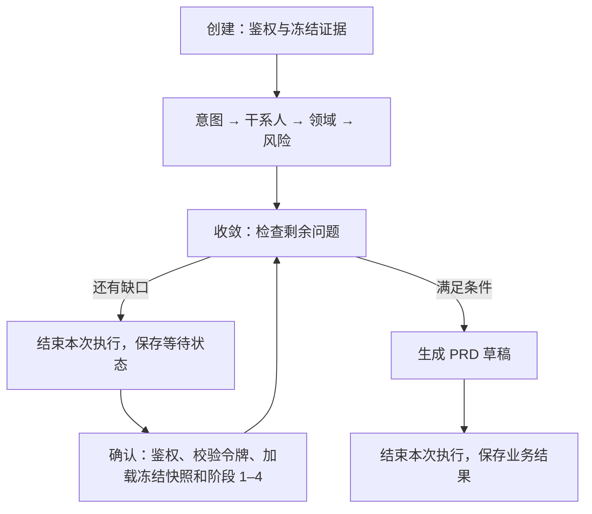

# LangGraph 应用与框架选型报告（ADR-0020）

- 日期：2026-09-15；项目代码基线：`5c136b4`。
- 状态：用户已同意 LangGraph 选型方向；本报告交付接入设计与独立示例，业务迁移尚未实施。
- 范围：先替换 Agent Service 六阶段分析的流程编排；延续 [ADR-0009](0009-objective-evidence-checkpoint-and-specialists.md) 的证据、恢复和审批语义，以及 [ADR-0015](0015-agent-service-bounded-context-facades.md) 的模块边界。

## 1. 结论：选 LangGraph，控制使用范围

本项目需要明确的阶段顺序、条件分支和人工补充后的继续执行。LangGraph 的 StateGraph 可以直接组织现有 Python 函数，把规则步骤与模型步骤放在同一流程中，适合当前六阶段分析。[S1]

首阶段只使用 **State、Node、Edge** 三类概念；业务等待与恢复继续使用现有数据库检查点。原生 checkpointer、`interrupt` 和 `Command(resume=...)` 留作长任务需求出现后的扩展。本报告据现有代码细化了此前“用 SQLite 保存框架检查点”的通用建议：现在已经有业务状态存储，立即再建一套会增加一致性与运维负担。

预期收益是统一流程表达、减少自行维护的调度约定、方便逐节点测试。没有框架对照实验，不能宣称更快、更省 token、召回更高或能自动消除幻觉。若只是给原流水线外面包一个 LangGraph 节点，却保留全部重复调度，就没有达到本次精简目标。

## 2. 为什么它更适合当前项目

以下比较的是项目适配程度，不是框架的通用排名。官方能力于 2026-09-15 核对；维护状态和 API 以后可能变化。

| 方案 | 已有长处 | 与本项目的适配及取舍 |
| --- | --- | --- |
| **LangGraph** | 显式状态图、条件边、并行、持久化与人工介入；节点可直接调用普通函数 [S1–S3] | 六阶段与业务分支可直接映射；现有检索、SDK、规则和审批继续复用。代价是仍须设计状态、合并规则、超时和副作用边界。 |
| LangChain 高层 Agent | `create_agent` 统一模型、工具和 middleware；其 Agent 构建在 LangGraph 上，同样可获得持久化与人工介入 [S4] | 做通用“模型选择工具”的助手很方便；本项目现成 SDK/工具已有治理，固定分析阶段需要更直接的流程控制，因此首阶段使用底层图接口。不能说 LangChain 不支持恢复。 |
| CrewAI | 角色、任务与团队协作；Flows 也有结构化状态、`@persist` 和人工反馈 [S5] | 若主要从角色/任务描述搭建协作流程，可优先评估。当前四个 specialist 是规则函数，不需要为了接框架重写成角色与任务模型；LangGraph 的函数节点与现有代码更直接对应。 |
| AutoGen | AgentChat、多 Agent 团队与消息协作；支持保存/加载 Agent 或 Team 状态 [S6–S7] | 更接近消息驱动的 Agent 协作。本项目目前没有自由对话式协商；且官方仓库当前标为维护模式，并建议新用户考虑 Microsoft Agent Framework，因此不选 AutoGen 作为新增依赖。此处只说明维护状态，不展开另一套技术栈。 |
| 继续自研 | 当前流程可用、业务语义清楚、不增加框架依赖 | 是有效基线；但图执行、分支约定与后续恢复能力要自行维护。选择 LangGraph 是把这部分收敛到一种主流约定，不是否定现有业务代码。 |

本次选择最看重三个因素：**与现有函数直接适配、流程与状态显式、后续恢复能力有成熟扩展路径**。如果任务只剩一次模型调用，直接用 SDK 更简单；如果主要是模型反复选工具，LangChain 高层 Agent 可能更省代码。

## 3. 技术栈如何精简

| 职责 | 接入后的安排 |
| --- | --- |
| HTTP 与结构校验 | 沿用 FastAPI、Pydantic |
| 六阶段流程 | 仅新增 LangGraph 作为直接编排依赖，替换对应手工阶段调度 |
| 模型调用 | 沿用当前 OpenAI-compatible SDK、配置、调用预算与降级策略；规则节点不额外调用模型 |
| 证据、业务检查点、审批 | 沿用现有数据库和领域存储；本机 H2/SQLite 及可选 MySQL 路径保持原职责 |
| 前端与媒体 | 沿用 React 和 Spring Media Service，无新增服务或前端框架 |

第一阶段不新增向量库、队列、模型供应商、云端工作流服务或观测平台。LangGraph 在现有 Python 服务中运行；安装开源库不要求采用托管部署。

“一种编排框架”不等于“安装包只有一个”。独立示例使用的 `langgraph==1.2.11` 包元数据包含 `langchain-core`、`langgraph-checkpoint`、`langgraph-prebuilt`、`langgraph-sdk` 等传递依赖。业务代码可只使用 `langgraph.graph`，无需同时学习 LangChain 高层接口。正式接入前仍须解析并锁定与项目现有版本兼容的完整依赖；本报告没有修改 `requirements.txt`。[S8]

## 4. 接到哪些现有代码

| 当前入口 | 拟采取的改动 | 保留的职责 |
| --- | --- | --- |
| [analysis_pipeline.py](../../services/agent-service/app/analysis_pipeline.py) | 将初始阶段与收敛/PRD 的执行顺序移入拟新增的 `app/analysis_graph.py`；提取可复用节点函数 | 规则提取、证据引用、问题判断、PRD 构造与返回模型 |
| [architecture/execution.py](../../services/agent-service/app/architecture/execution.py) | 继续暴露 `run_six_stage_analysis` / `resume_six_stage_analysis`，内部调用图适配器 | 调用方兼容入口 |
| [routes/analysis.py](../../services/agent-service/app/routes/analysis.py) | 保持创建、确认和发布的 HTTP 契约 | 鉴权、授权 scope、恢复令牌校验与响应映射 |
| [analysis_evidence.py](../../services/agent-service/app/analysis_evidence.py) | 首阶段直接复用 | 目标检索、授权、排名、revision/hash 与冻结证据 |
| [analysis_store.py](../../services/agent-service/app/analysis_store.py) | 首阶段继续作为业务检查点唯一写入方 | session、阶段、确认、令牌 CAS 和版本递增 |
| [publication_service.py](../../services/agent-service/app/publication_service.py) | 不进入自动图执行 | PRD 发布、独立知识审批、审计与副作用治理 |

初期先完成这条分析路径。问答的 Router/Planner、SSE 和工具路径继续使用现有实现，避免同时改造两个有不同恢复语义的流程。已有领域模块按职责复用，不为了减少文件数量合并成一个大模块。

## 5. 状态、节点、分支怎么设计

拟定的图状态包含 `objective`、已授权的有界冻结证据、`stages`、`confirmations`、`open_questions`、specialist 结果及 PRD 草稿。`session_id`、证据 revision/hash 与恢复令牌继续由接口和业务存储管理，不为了图复制一套权威记录。模型输出不能改变授权 scope；JWT、连接对象和数据库事务不放入状态。进入图前完成身份验证与证据加载，确认恢复时再次验证访问权。

六个业务节点是 intent、stakeholders、domain、risks、convergence、prd。节点返回新的状态字段，不随意改写已冻结证据。domain 首阶段复用四个规则 specialist；若以后拆成并行图节点，各自写独立结果键，汇总时仍按业务、数据安全、技术集成、规则合规排序，不能依赖完成顺序。



创建路径执行全部必要阶段；恢复路径从 convergence 开始，保留阶段 1–4。补充后仍有缺口就再次等待，不能把“收到确认请求”直接等同于“可生成 PRD”。图返回草稿后，发布仍走独立审批。

## 6. 最小 API 示例

下面是完整的流程示例，仅用阶段名称模拟业务输出，不执行真实检索、鉴权、specialist、数据库或 PRD 生成。它说明 StateGraph 的接线方式，不是可直接替换项目的生产实现。独立环境使用 Python 3.12 与 `langgraph==1.2.11`；复制为 `demo.py` 后可用 `uv run --no-project --isolated --with langgraph==1.2.11 demo.py` 运行。

```python
from typing import TypedDict

from langgraph.graph import END, START, StateGraph


class State(TypedDict):
    resume: bool
    missing: bool
    stages: list[str]
    visited: list[str]


names = ["intent", "stakeholders", "domain", "risks", "convergence", "prd"]


def stage_node(name: str):
    def execute(state: State):
        prefix = state["stages"][:4] if name == "convergence" else state["stages"]
        return {"stages": [*prefix, name], "visited": [*state["visited"], name]}
    return execute


builder = StateGraph(State)
for name in names:
    builder.add_node(name, stage_node(name))
builder.add_conditional_edges(
    START,
    lambda state: "convergence" if state["resume"] else "intent",
    {"convergence": "convergence", "intent": "intent"},
)
for source, target in zip(names[:4], names[1:5], strict=True):
    builder.add_edge(source, target)
builder.add_conditional_edges(
    "convergence",
    lambda state: "wait" if state["missing"] else "ready",
    {"wait": END, "ready": "prd"},
)
builder.add_edge("prd", END)
graph = builder.compile()  # 首阶段不启用框架 checkpointer。

initial = {"resume": False, "missing": True, "stages": [], "visited": []}
waiting = graph.invoke(initial)
assert waiting["visited"] == names[:5]
assert initial["stages"] == []

# 实际应用由服务端加载这些业务检查点字段，不能直接相信客户端输入。
checkpoint = {"resume": True, "missing": False,
              "stages": waiting["stages"][:4], "visited": []}
completed = graph.invoke(checkpoint)
assert completed["visited"] == ["convergence", "prd"]
assert completed["stages"] == names
assert checkpoint["stages"] == names[:4]

still_waiting = graph.invoke({**checkpoint, "missing": True})
assert still_waiting["visited"] == ["convergence"]
assert still_waiting["stages"] == names[:5]
fresh_complete = graph.invoke({**initial, "missing": False})
assert fresh_complete["visited"] == names
print("PASS: initial wait, resume, repeated wait, direct completion")
```

实际迁移必须把示例里的 `missing` 替换为真实规则判断，把阶段名列表替换为现有 Pydantic 结果；恢复入口验证阶段 1–4 均完成。节点里的模型调用仍经过现有 SDK 包装层，以保留预算、配置与降级；不能绕过 wrapper 直接创建新客户端。

## 7. 为什么首阶段复用业务检查点

当前创建接口在分析结束后保存 session；确认接口加载冻结证据并计算候选结果，随后 `transition_confirmation` 用旧恢复令牌做 CAS。两个并发请求可能都计算，但只有一个提交，另一个得到 409。它没有承诺计算只发生一次；未来带副作用或收费模型的重试必须单独设计。

首阶段 `graph.compile()` 不配置 checkpointer，缺信息时通过条件边结束本次调用，由原存储保存 `WAITING_CONFIRMATION`。确认请求是从业务状态重建输入并再次执行图，**不使用原生 `interrupt`、不恢复 Python 栈，也不具备节点执行中途崩溃恢复**。中途进程退出只保留此前已经提交的业务检查点，不能把图编排等同于 durable execution。

后续确需长任务节点级恢复时，再引入持久化 checkpointer 与 `interrupt`：[S2–S3]

1. 明确图执行状态与业务审批状态的归属，设计一致性与失败补偿；不能直接做两次互不关联的数据库提交。
2. 服务端按已授权 session 映射 `thread_id`；`thread_id` 本身不是身份凭证，恢复前仍做权限与令牌检查。
3. `interrupt` 恢复会重新执行所在节点，暂停前的副作用须幂等；仅靠当前计算后 CAS 不足以保护并发 `Command(resume=...)`，需要执行准入/租约等机制。
4. 本地实验可用 SQLite saver；MySQL 部署需要验证相应存储适配与迁移，不能默认官方 SQLite saver 兼容 MySQL，也不为演示立即增加 PostgreSQL。

这部分是扩展条件，不是当前已完成能力。首阶段不采用它，因此还没有获得 LangGraph 原生持久化执行的收益。

## 8. 对故障、召回和幻觉有什么帮助

| 问题 | LangGraph 能提供的结构 | 项目仍须实现或验证 |
| --- | --- | --- |
| 多 Agent 通信 | 节点通过类型明确的状态传递结果；并行结果可显式合并 | 当前 specialist 是同进程规则函数；不是网络消息协议或自治 Agent 团队 |
| specialist 失败/挂起 | 把错误和降级出口写成明确分支，便于故障注入 | 当前异常能转人工复核，但永久挂起仍可能阻塞。安装框架不会强杀线程；截止、准入容量、迟到结果隔离与必要时的进程隔离需要实现 |
| 召回质量 | 固定检索、筛选、生成顺序，方便定位证据在哪一步丢失 | 复用原检索器不会自动提高召回；继续区分当前 Hit@3 与严格 Recall@K |
| 幻觉处理 | 可显式放置证据检查、审核、有限重试与人工接管节点 | 当前 Reviewer 仍是轻量规则；引用格式与事实正确不同。严格语义审核和真实模型留出集不会由框架自动生成 |

详细问题继续由 [面试技术答辩](../../docs/INTERVIEW_GUIDE.md) 维护，本文只解释框架接入的影响。

## 9. 实施顺序与验收

| 步骤 | 交付 | 完成条件 |
| --- | --- | --- |
| A：本报告 | 选择理由、源码映射、运行示例、明确边界 | 官方资料可追溯；示例与文档检查通过；应用现状不被误写为已迁移 |
| B：首阶段迁移 | 在现有 façade 后实现六节点图，保留两个公开 Python 入口 | 移除被替代的手工阶段调度；正常、等待、重复等待和恢复输出与基线一致；没有为了图再建业务状态存储 |
| C：故障保护 | specialist 截止、容量准入、降级与迟到结果隔离 | 用受控阻塞和持续饱和验证请求在设定期限内结束；关键缺口进入确认，不能静默发布；不把 Future.cancel 当强制终止 |
| D：按需扩展 | 仅在长任务需要时引入原生检查点 | 重启恢复、并发恢复、重复副作用、状态一致性和数据迁移均有回归；另行核对部署范围 |

B 阶段验证至少覆盖：首次缺资料不生成 PRD、补充后仍可能等待、阶段 1–4 完全保留、等待期间新增材料不改变快照、空证据不能通过确认文本补造、并发确认一个 200/一个 409、租户隔离、固定 specialist 合并顺序、发布/知识/工单审批边界。对应 [analysis workflow 回归](../../services/agent-service/tests/test_analysis_workflow.py)、[PRD 评测](../../quality/agent-evals/evaluate_prd.py) 与 [平台验收](../../scripts/local_acceptance.py)。

应用迁移完成前运行 Agent 全量、PRD、相关检索/生命周期门禁、Python/Web lint、维护索引与 localhost 验收；若修改共享检索或会话，再运行 V6/Conversation 专项。A 阶段的示例通过不替代这些业务验证。

对比迁移前后时使用同一 Python、模型配置、证据快照和问题集，记录冷/热启动、P50/P95、失败率、模型调用次数与 token、直接/传递依赖、被删除和新增的调度代码。规则 baseline 的 token 为零不能拿来证明真实模型节省；没有同条件数据就不填提速百分比。既有 V6 指标名称和历史数字保持原口径。

## 10. 面试怎么说明

在迁移完成前可以说：

> 当前项目仍用自研业务编排。为了控制学习和维护成本，我选择 LangGraph 作为六阶段流程的迁移方向，用显式状态与分支连接现有函数。第一阶段复用已有证据快照和业务检查点，避免重复存储；原生持久化执行按长任务需求再引入。相比其他框架，这是对本项目的适配选择，不是性能排名。权限、审批、超时与事实审核仍由业务实现和测试保证。

迁移通过验收后，再把“迁移方向”改为“已接入”，并补实际版本、提交与门禁结果。不能在简历上提前写“LangGraph 原生断点恢复已实现”。

## 官方资料与验证记录

- [S1：LangGraph 概览](https://docs.langchain.com/oss/python/langgraph/overview)：显式编排、混合规则/模型节点、独立于 LangChain 高层接口使用。
- [S2：LangGraph Interrupts](https://docs.langchain.com/oss/python/langgraph/interrupts)：检查点、thread_id、恢复与节点重执行。
- [S3：LangGraph Persistence](https://docs.langchain.com/oss/python/langgraph/persistence)：持久化存储与 saver 使用边界。
- [S4：LangChain 概览](https://docs.langchain.com/oss/python/langchain/overview)：create_agent 及其与 LangGraph 的关系。
- [S5：CrewAI Flows](https://docs.crewai.com/en/concepts/flows)：结构化状态、@persist 与 human feedback；文档注明人工反馈装饰器需要相应版本。
- [S6：AutoGen 官方仓库](https://github.com/microsoft/autogen)：维护状态与新用户建议，按核对日期理解。
- [S7：AutoGen 状态管理](https://microsoft.github.io/autogen/stable/user-guide/agentchat-user-guide/tutorial/state.html)：Agent/Team 的 save_state 与 load_state。
- [S8：LangGraph 1.2.11 包元数据](https://pypi.org/pypi/langgraph/1.2.11/json)：本示例版本的 Python 要求与依赖；不是对项目兼容性的验收结论。

本机源码与官方资料核对完成；上述代码块提取到忽略目录后，以隔离环境实跑，首次等待、恢复完成、再次等待、直接完成四条路径均通过，且输入阶段列表未被改写。日志为 `runtime/codex-langgraph-report-example.log`；这仅验证 API 接法，不验证实际鉴权、数据库恢复或 PRD 质量。完整文档检查、lint 与知识更新结果写入 [QUALITY](../QUALITY.md)。本报告兼作架构决策记录，面试指南只保留口述和入口，不再另建一份重复选型材料。
